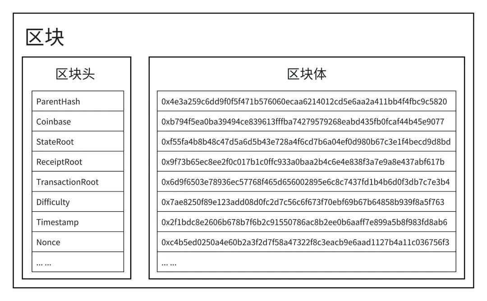
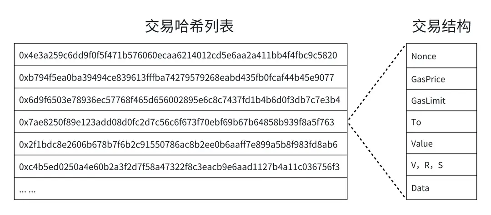
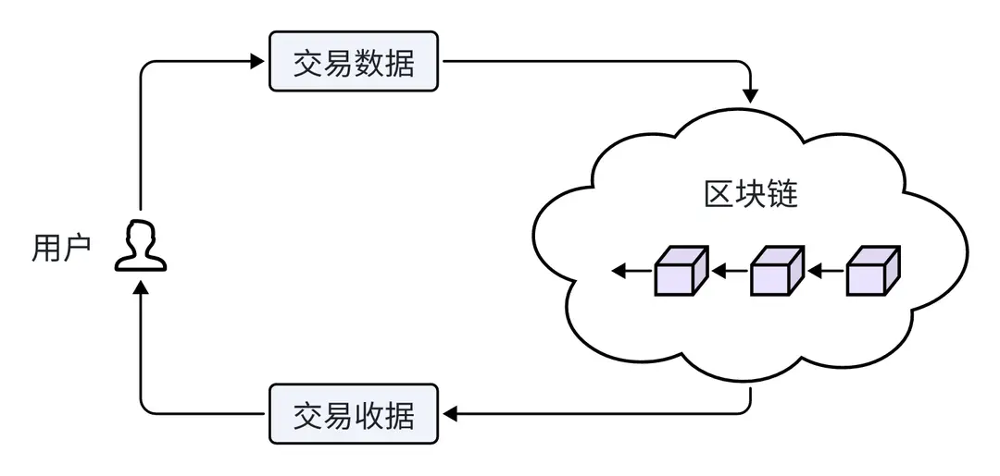
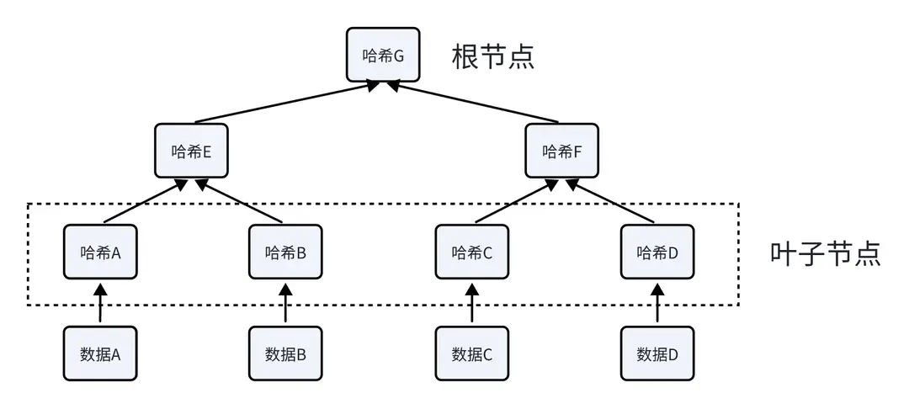
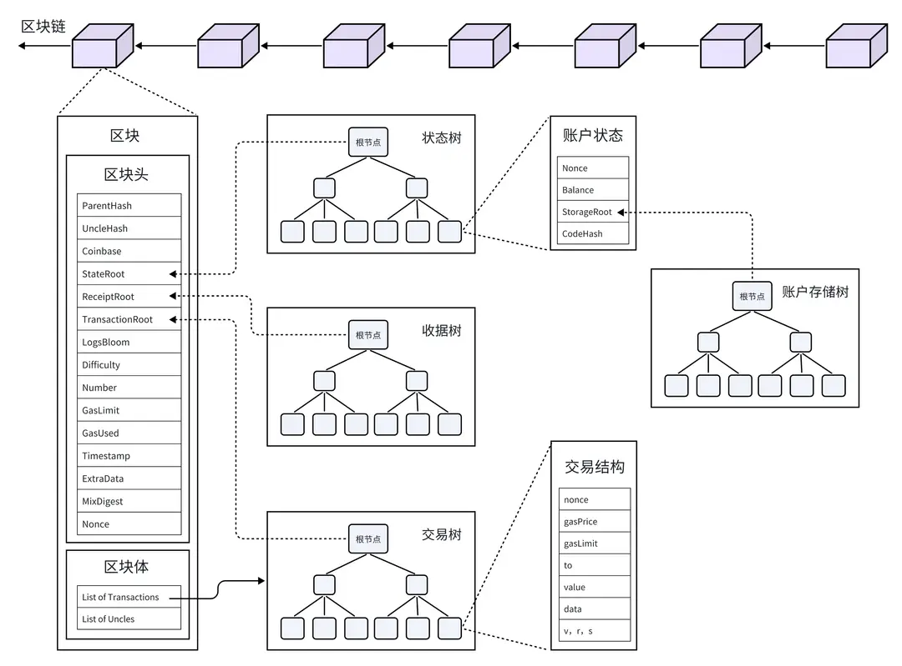
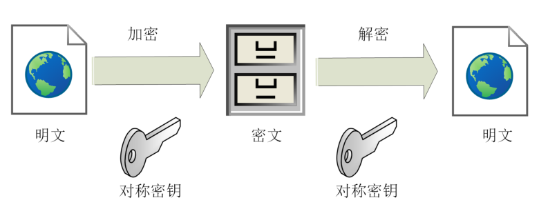
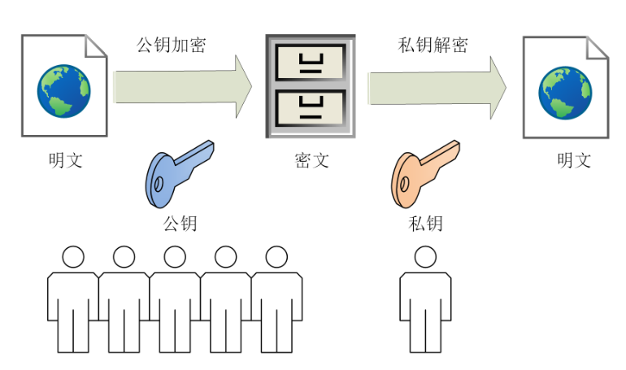
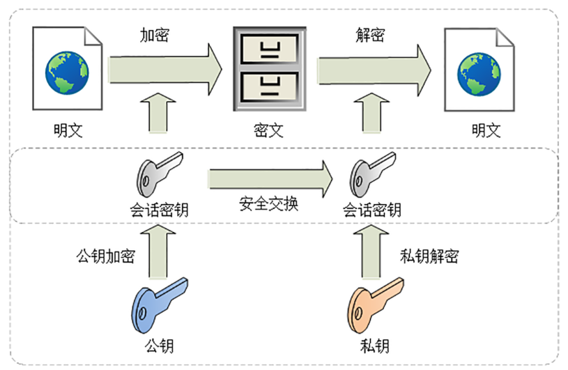
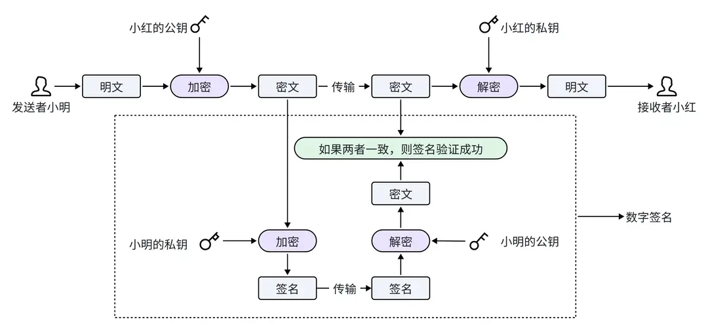
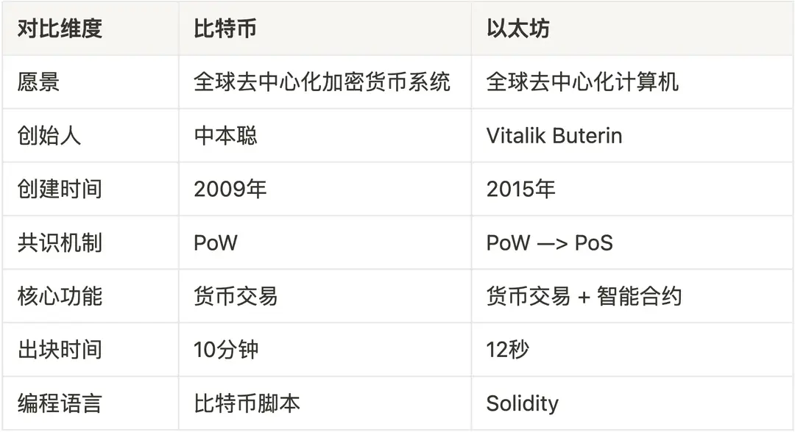

# 0 介绍

> 1、[js版本区块链学习地址](https://github.com/smartcontractkit/full-blockchain-solidity-course-js?tab=readme-ov-file)
> 2、[基础知识_书籍](https://github.com/inoutcode/ethereum_book)
> 3、[一些概念 (zhihu.com)](https://zhuanlan.zhihu.com/p/101417295)
> 4、[基于Go的Ethereum 源码剖析](https://github.com/ABCDELabs/Understanding-Ethereum-Go-version)

## 0.1 建议

> 三个黑客松，Chainlink、ETHGlobal、Devfolio

> 以太坊问题的三个论坛：Stack Exchange Ethereum 、Stack Exchange Eth、 Ethereum Stack Exchange 


## 0.2 什么是web3

Web 3，又称为去中心化的互联网，是一种新兴的网络范式，旨在解决Web 2时代的中心化和隐私问题。它基于区块链和分布式技术，旨在实现更开放、透明和用户主导的网络体验。

**重点特点：**
- **去中心化（这也是围绕在这份知识库的核心理念）：** Web 3的核心概念是去中心化，它不依赖于单一的中心化服务器，而是通过分布式网络节点共同维护和处理数据。
- **区块链技术（我们将会在下面详细介绍）：** 区块链是Web 3的基石，它提供了安全的分布式账本，确保数据的透明性和防篡改性。
- **加密货币：** 加密货币作为交易媒介在Web 3中发挥重要作用，它们使得去中心化的价值交换成为可能。
- **智能合约：** 智能合约是自动执行的代码，能够在不需要中介的情况下进行交易和协议执行。
- **用户数据控制：** Web 3强调用户对自己数据的控制权，用户可以选择共享数据，并从中获益，而不是被中心化平台收集和操控。
- **身份验证与隐私：** Web 3提供了更安全和隐私保护的身份验证方式，确保用户在互联网上的匿名性和隐私。
- **开放协议：** Web 3鼓励开放协议的使用，使不同应用能够相互连接和互操作，从而创造更多样化的网络生态系统。

**重要部分：**

- 区块链技术 是实现Web 3去中心化特性的基础，它确保了数据的安全性和可信性。
- 智能合约让无需第三方干预的可编程交易和协议成为可能，推动了去中心化应用的发展。
- 加密货币 作为Web 3的经济基础，支持用户之间的价值交换，打破了传统金融的壁垒。
- 用户对于个人数据的控制权 强调了隐私保护的重要性，将数据从中心化平台转移到用户手中。
- 开放协议 促进了不同应用的协同工作，创造出更加丰富和创新的网络生态。

**Web2与Web3的区别与联系**

**区别：**

- **中心化 vs. 去中心化：** Web2是中心化的互联网，由少数大型平台掌控用户数据和内容分发。而Web3则是去中心化的，基于区块链技术，数据和控制权分散在网络参与者之间。
- **数据控制：** Web2时代，用户数据通常由平台收集和控制，而Web3强调用户对个人数据的控制权，数据可以被加密并分散存储，从而保护用户隐私。
- **隐私和安全：** Web2平台存在数据泄露和隐私问题，而Web3使用加密技术保护用户隐私，提供更安全的身份验证和数据传输。
- **价值交换：** Web2中，大多数内容和服务是免费的，平台通过广告获利。而在Web3中，加密货币和智能合约使得用户能够直接交换价值，内容创作者可以通过更直接的方式获得报酬。
- **中介与智能合约：** Web2需要中介机构处理交易，而Web3通过智能合约自动执行交易，减少了中介的需求。

**联系：**

- **区块链技术：** Web3的基础是区块链技术，它确保了数据的安全性和可信性，使得去中心化的网络成为可能。
- **智能合约：** 智能合约是Web3的重要组成部分，它在两者中都起到关键作用，但在Web3中更广泛使用，使得自动化交易和协议成为可能。
- **用户主导：** Web3强调用户对网络的控制，这与Web2时代用户产生内容和互动的趋势相呼应，但Web3赋予了用户更大的控制权。
- **数据隐私：** Web3通过加密技术和去中心化存储保护用户的隐私，这与Web2中隐私问题相对比。
- **开放协议：** Web3鼓励开放协议的使用，使不同应用能够相互连接和互操作，这也反映了Web2时代开放API和互操作性的趋势。


## 0.3 如何参与 Web3 

### 0.3.1 如何获得加密货币

- 在中心化交易所购买：在交易所中，例如币安（ Binance ）和欧易（ OKX ）等，可以用法币直接购买加密货币。

- 从其他钱包转账：你可以从自己的其他钱包向这个新钱包转账，或让其他人给你转账。

- 参与项目空投活动：某些新项目为了推广，可能会给参与活动的用户免费分发一些代币。
- 通过挖矿获取：如果你有能力和资源，可以通过挖矿的方式获得加密货币作为奖励。


### 0.3.2 如何购买 NFT

Element Market 是一个去中心化的 NFT 交易平台，允许用户浏览和交易各种数字艺术品。

下面介绍一下如何在 Element Market 中购买 NFT：

●第1步：打开浏览器并访问 Element Market 的官方网站（https://element.market/），在网站的右上角选择网络类型，点击连接钱包按钮，然后按照提示操作连接钱包。

### 0.3.3 查看所有数字资产

如果你想查看 MetaMask 钱包中所有的数字资产，可以打开https://portfolio.metamask.io/网页。如下方所示，在这里，你可以查看所有的 Tokens 和 NFTs。


## 0.4 赛道趋势

Web3 致力于构建一个去中心化、由用户主导的下一代互联网。在这个生机勃勃的领域中，广泛分布着各种类型的赛道，涵盖了去中心化金融（ DeFi ）、非同质化代币（ NFT ）、去中心化自治组织（ DAO ）、去中心化身份（ DID ）、社交金融（ SocialFi ）、游戏金融（ GameFi ）和基础设施等关键领域。

### 0.4.1 去中心化金融（ DeFi ）

去中心化金融（ Decentralized Finance，简称DeFi ）是基于区块链、智能合约技术的金融服务和应用，允许用户直接通过智能合约进行金融交易。与传统的中心化金融（ CeFi ）不同，**DeFi 不依赖中央权威或中介机构来提供金融服务。**在 DeFi 生态中，传统金融中的银行、经纪人和其他中介机构**被智能合约所代替**，一切都是通过代码来自动运行的，并且是开放透明的，任何人都可以参与验证。

去中心化金融为用户提供全球范围内无缝接入的金融服务，包括很多创新性的金融产品和服务，典型的 Defi 项目有 Uniswap（去中心化交易平台）、Aave（去中心化借贷平台）、MakerDAO（去中心化稳定币 DAI ）等，这些项目推动金融行业向更加开放、透明和包容的方向发展。同时，DeFi 还通过分布式账本技术保障了金融交易记录的不可篡改性，从而增强了金融系统的安全性。

### 0.4.2 非同质化代币（ NFT ）

非同质化代币（ Non-Fungible Token，简称NFT ）是一种特殊类型的加密资产，它建立在区块链技术之上，通过智能合约保证其唯一性和稀缺性。与传统的加密货币（如比特币或以太坊）不同，每个 NFT 都有独特的身份标识。每个 NFT 就像一件有独特编号的艺术品或收藏品，比如一幅画或一枚限量版邮票，因为它们各自有不同的价值和特征，所以你不能简单地把它们进行交换。

非同质化代币具备唯一性和所有权的不可篡改性，这为数字内容创造者提供了将作品货币化的方式。典型的 NFT 项目有数字艺术平台 OpenSea 和 Rarible，这些平台让创作者能够直接向收藏爱好者销售其作品。此外，NFT 还可以用于游戏中，例如加密猫（ CryptoKitties ）这个游戏，每只猫咪都是一个独特的 NFT，玩家可以在游戏里购买、繁育和交易猫咪。随着 NFT 技术的成熟和市场的认可， NFT 正在逐渐扩展到更多的领域，如音乐、影视和体育等。

> NFT，全称为非同质化代币（Non-Fungible Token），是一种基于区块链技术的数字资产。与传统的加密货币（如比特币或以太币）不同，NFT 代表的是独一无二的、不可替代的资产，每个 NFT 都具有唯一性和独特性。

要理解 NFT，首先需要理解 "非同质化" 和 "同质化" 的概念：

- **同质化（Fungible）资产**：同质化资产是可以**互相替换的**，每个单元都具有相同的价值。例如，传统的货币（比如美元或比特币）就是同质化资产，因为每个单位的货币在价值和功能上都是相同的，所以可以相互交换而不影响价值。

- **非同质化（Non-Fungible）资产**：非同质化资产是**唯一的**、独特的，每个单元都有自己独特的属性和价值。例如，艺术品、房地产、收藏品等都是非同质化资产，因为它们的价值和属性是不同的，无法直接互换。
  **应用**：
  NFT 就是基于区块链技术创建的一种非同质化资产，每个 NFT 都具有唯一的标识符和元数据，可以代表数字艺术品、虚拟地产、游戏道具、音乐作品、域名等各种类型的数字资产。NFT 的唯一性和不可替代性使得它在数字艺术、游戏、虚拟现实等领域具有广泛的应用价值。

NFT 的创建和交易通常使用智能合约技术，在以太坊等区块链平台上进行。它们的独特性和不可分割性使得每个 NFT 都有自己的所有权和价值，可以在区块链上安全地交易和流通。


### 0.4.3 去中心化自治组织（ DAO ）

去中心化自治组织（ Decentralized Autonomous Organization，简称DAO ）是一种基于区块链技术的创新组织形式，它不同于传统的中心化管理结构。在 DAO 中，权力和决策过程是分散的，对于重大的问题，比如资金分配、规则制定和项目发展方向等，不是由单个领导或小团体决定，而是由持有组织代币的成员共同投票决策。DAO 通过把规则写入代码中，由智能合约来自动执行，确保了规则的确定和透明。

去中心化自治组织允许成员在没有中央管理者的情况下共同做出决策，这样的组织形式能够促进更加公平和透明的决策过程，同时也增强了社区成员之间的协作。典型的 DAO 项目有 MolochDAO，它是一个专注于为以太坊生态系统提供资金支持的组织，其运作方式是成员提交提案请求资金，然后其他成员共同投票决定是否批准这些提案，如果有足够多的投票支持，那就会从 DAO 的资金库中拨款来执行这些提案。MolochDAO 的提案信息是公开的，任何人都可以查看项目的介绍、投票和执行情况，从而增加了透明度和社区参与度。


### 0.4.4 社交金融（ SocialFi ）

社交金融（ Social Finance，简称 SocialFi ），结合社交网络和去中心化金融（ DeFi ）的特点，通过区块链技术，实现了社交互动的同时进行资产的生成、交换和增值。与传统社交平台不同的是， SocialFi 平台让用户在参与社交活动如发帖、评论、分享内容时得到实质性的经济奖励，比如代币或 NFT，同时保证了他们对自己数据的所有权和控制权。这种模式打破了传统社交网络的利益分配机制，将价值回馈给内容创造者和社区成员。

社交金融重新定义了内容创造和社区参与的奖励系统，用户不仅能享受社交乐趣，还能从中获得实际收益。Mirror 是当前较为主流的 SocialFi 项目之一，Mirror 平台利用区块链技术确保创作者拥有其作品的数字版权，并且能够通过加密货币进行收益分配。比如创作者在平台上发布文章后，可以根据文章的受欢迎程度和用户的互动情况（点赞、分享、评论等），获得相应的代币奖励。创作者还可以在平台上进行众筹活动，使用智能合约创建代币化的众筹项目，这些代币可能会随着创作者的成功而增值，从而吸引投资者支持他们的创作。


### 0.4.5 游戏金融（ GameFi ）

游戏金融（ Game Finance，简称 GameFi ）是一种结合了加密货币和非同质化代币（ NFT ）的游戏模式，玩家可以在虚拟的游戏世界中参与活动，并通过这些活动获得实际的经济回报。这种游戏模式赋予玩家拥有资产的所有权和交易能力，允许他们自由地买卖、交换或投资这些资产。GameFi 项目往往集成了 DeFi（去中心化金融）的功能，如流动性挖矿、借贷和收益农场，使玩家在享受游戏乐趣的同时，还能参与到复杂的金融活动中。

游戏金融创造了一个全新的经济模型，玩家的时间和技能可以转化为现实世界的财富，同时也促进了数字资产的流通和创新。Axie Infinity 作为典型的 GameFi 项目，让用户通过购买、培育、繁衍及交易虚拟宠物来参与游戏。这些宠物如果拥有稀缺的属性，往往具有更高的市场价值，用户可通过繁殖和销售这些宠物来赚取利润。此外，用户参加战斗也能够赚取 SLP 和 AXS 代币，这些代币可以在加密货币市场兑换成真实的货币。同时，将 AXS 和 SLP 代币质押到 DeFi 协议中，用户还有机会获得额外的收益。


### 0.4.6 去中心化身份（ DID ）

去中心化身份（ Decentralized Identity，简称 DID ），是一种基于区块链技术的身份认证方式，使得用户无需依赖于任何中心化组织或服务提供商，就能够拥有并控制自己的身份信息。在这个系统中，用户的身份数据被加密并分散存储在区块链网络上，用户可以自主管理其身份证明和相关数据，使用私钥进行安全验证，以此确保身份信息的可靠性和隐私性。

去中心化身份为用户提供了身份数据主权和隐私保护，一个典型的 DID 项目例子是 ENS（ Ethereum Name Service ），它允许用户将复杂的以太坊钱包地址转换为易读易记的域名，如“ alice.eth ”，从而简化了转账过程，并且提升了用户体验。此外，这些域名也是用户在 Web3 世界的身份标志，通过 ENS，用户可以更方便地管理和展示自己的去中心化身份。


### 0.4.7 基础设施赛道

基础设施赛道为整个 Web3 生态系统的运行提供了必需的底层技术支持，就像建筑需要坚固的地基那样，基础设施提供一系列的关键技术组件，包括区块链协议、智能合约平台、节点网络、分布式存储和跨链互操作协议等，这些组件确保了所有应用和服务能够安全、高效地运行。

基础设施赛道为 Web3 生态提供了稳固的根基，使得开发者能够构建出更加复杂、功能丰富的去中心化应用。典型的基础设施非常多，比如，以太坊（ Ethereum ）提供了一个智能合约平台，允许开发者在上面创建各种去中心化应用；IPFS（ InterPlanetary File System ）是一个分布式存储网络，解决了数据存储与传输的问题；而 Polkadot 和 Cosmos 等项目则致力于解决区块链间的互操作性问题，允许不同的区块链网络之间进行信息和价值的传递。这些基础设施项目是 Web3 生态发展的基石，对于推动整个行业的创新和成熟起着至关重要的作用。


## 0.5 网站

### 0.5.1 一些框架

#### 0.5.1.1 前端

1. [RainbowKit](https://www.rainbowkit.com/zh-CN/docs/introduction)
   
    > RainbowKit 是一个 [React](https://reactjs.org/) 库，可以轻松地将钱包连接添加到您的 dapp。它直观、响应迅速且可自定义。 
    > 注意，里面有个[Wagmi](https://wagmi.sh/)是前端一个hook库。
    
2. 

#### 0.5.1.2 后端

1. [Home | go-ethereum](https://geth.ethereum.org/)


### 0.5.2 币圈

1. [binance | 币安](https://www.binance.com/zh-CN)
2. [OKX | 欧易](https://www.okx.com/zh-hans)


# 1 区块链

> 区块链是在计算机网络节点之间共享的分布式数据库或账本。它们以其在加密货币系统中的关键作用而闻名，以维护安全和去中心化的交易记录，但它们不仅限于加密货币的用途。区块链可用于使任何行业的数据不可变，该术语用于描述无法更改。

- 去中心化
- 分布式账本
- 不可篡改性
- 可溯源性
- 加密保护

## 1.1 去中心化

Web 3的核心概念是去中心化，它不依赖于单一的中心化服务器，而是通过分布式网络节点共同维护和处理数据。

## 1.2 分布式账本

每一条区块链都是一个分布式账本，所有的交易记录不是存放在一个中央服务器上，而是分散存储在网络中的所有计算节点中，每个节点都有一份交易账本的拷贝，这些拷贝是完全相同且实时更新的。当有新的交易发生时，这个交易会被发送到网络中的所有节点，并通过矿工验证确保其有效性。一旦交易被验证，它就会被添加到账本的最新页面上，也就是区块中，并且这个过程是不可逆的，一旦记录下来，就无法被篡改或删除。

**分布式账本的关键特点**

1. **分布式存储**：
   - 数据记录在多个节点上，这些节点可以是地理上分散的计算机或服务器。每个节点持有账本的一个副本。
2. **共识机制**：
   - 分布式账本使用共识机制来确保所有节点对账本中的数据达成一致。常见的共识机制包括工作量证明（Proof of Work，PoW）、权益证明（Proof of Stake，PoS）等。
3. **不可篡改性**：
   - 一旦记录被写入分布式账本，通常是不可篡改的。任何更改都需要经过共识过程，并且会记录下变更的历史。
4. **去中心化**：
   - 没有单一的控制节点，所有参与节点共同维护账本的完整性和准确性。
5. **透明性和可追溯性**：
   - 所有交易和数据更新都是公开可见的，并且可以追溯到其源头，增强了系统的透明度。

**分布式账本的工作原理**

1. **数据记录**：
   - 交易或数据更新请求提交到分布式账本网络中，所有节点接收到这些请求。
2. **验证和共识**：
   - 节点使用共识机制验证交易或数据更新的合法性。只有在达成共识后，交易或数据更新才会被记录在账本上。
3. **同步和更新**：
   - 一旦达成共识，账本的最新状态会在所有节点间同步更新，确保每个节点持有一致的账本副本。
4. **安全和加密**：
   - 通过加密技术确保数据传输和存储的安全性，防止未经授权的访问和篡改。

**例子：区块链**

区块链是分布式账本技术的一种实现方式，具有以下特点：

1. 块和链
   - 交易数据被打包成块，每个块包含一组交易记录和一个指向前一个块的哈希值，形成链式结构。
2. 去中心化和共识
   - 没有中心化的控制，每个节点都可以参与记账和验证，常用的共识机制有 PoW 和 PoS。
3. 智能合约
   - 支持自动执行的合约，允许在满足特定条件时自动执行代码，提高自动化和效率。


## 1.3 区块链的数据结构

区块链是一系列数据块（即“区块”），通过特定的方式相互连接，形成的一条链。每个区块都包含前一个区块的哈希值，称为“父哈希值”（ Parent Hash ），这是前一个区块内容的唯一标识符。通过这种方式，每个区块都与前一个区块相连接，形成了一条从第一个区块（创世区块）到最新区块的连续链条，这就是“区块链”。注：第一个区块里无父哈希值。


### 1.3.1 区块

区块链中的每一个区块，都由两个部分组成：区块头（ Header ）和区块体（ Body ）。

**①区块头**

区块头里包含了一个区块的基本信息，主要包括：

●父哈希值（ parentHash ）：记录前一个区块的哈希值。

●时间戳（ timestamp ）：记录区块创建的具体时间。

●随机数（ nonce ）：用于工作量证明（ PoW ）机制中的挖矿过程。

●难度目标（ difficulty ）：表示挖矿的难度。

●币基（ coinBase ）：标识矿工的账户地址。

另外，区块头里还记录了三个非常重要的根哈希值：

●状态树根（ stateRoot ）：表示了区块链的状态树的根哈希值，状态树记录了所有账户的状态信息，如余额、合约代码等。

●收据树根（ receiptRoot ）：表示收据树的根哈希值，收据树记录了交易执行的结果，如交易是否成功、交易费用等。

●交易树根（ transactionRoot ）：表示交易树的根哈希值，交易树包含了区块中所有交易的信息。

**②区块体**

区块体里存储了该区块中的所有交易数据，即所有交易哈希的列表。



### 1.3.2 交易

在以太坊中，交易代表从一个账户向另一个账户发送资产或消息的行为。当用户发起一笔交易时，以太坊客户端或钱包软件将会构造交易数据。交易数据主要包含如下字段：

●nonce：发送方账户的交易计数器，统计该账户在此区块链中的总交易次数。

●gasPrice：发送方愿意为每单位 gas 支付的价格。

●gasLimit：发送方为这次交易设置的最大 gas 消耗量。

●to：接收方的账户地址。

●value：要传输的以太币数量。

●data：智能合约相关的字节码。

●v, r, s：交易签名，由发送方的私钥生成。

交易数据构造完成后，钱包将使用用户的私钥对整个交易进行签名，并将签名结果（ v, r, s ）加入交易数据中，然后对整个交易数据（不包括签名）计算哈希值，交易哈希是交易数据的唯一标识符，确保了交易的唯一性和不可篡改。



例如，Alice 想要发送 1 ETH 给 Bob，Alice 的账户地址是 0x123…ABC，Bob 的账户地址是 0x456…DEF。Alice 的账户已经执行过5笔交易，所以她的下一笔交易的 nonce 为6。当前的 gas 价格是 20 Gwei，她设置的 gas limit 是21000（标准以太坊转账所需的gas费）。Alice 不调用任何合约，所以 data 字段为空。

●nonce: 6

●gasPrice: 20000000000 (20 Gwei)

●gasLimit: 21000

●to: 0x456…DEF

●value: 1000000000000000000 (1 ETH)

●data: 0x

●v, r, s: [签名数据]

Alice 的钱包会把这些交易数据进行打包和签名，然后生成交易哈希，并将这个交易广播到以太坊网络。矿工将确认这笔交易并将其加入新区块，一旦成功，1 ETH 就会从 Alice 的账户转移到 Bob 的账户。

### 1.3.3  交易收据

在以太坊中，当一笔交易完成后，会生成“交易收据”（ Transaction Receipt，又叫交易回执）。交易收据记录了交易执行的基本信息，是交易被包含在区块链中的重要证据。



每个交易收据包含的信息有：

●transactionHash：交易哈希值，用于唯一标识一笔交易。

●transactionIndex：交易在所在区块中的索引位置。

●blockHash：包含该交易的区块哈希值。

●blockNumber：包含该交易的区块编号。

●from：发起交易的地址。

●to：交易的目标地址。

●cumulativeGasUsed：当前区块中累积消耗的 Gas 量。

●gasUsed：这笔交易所消耗的 Gas 量。

●contractAddress：如果交易用于创建合约，则表示合约地址；否则为 null。

●logs：交易过程中产生的事件日志。

●logsBloom：布隆过滤器，用于快速检索交易日志。

●status：交易执行的状态码，表示成功或失败。

###  1.3.4 默克尔-帕特里夏树 Merkle Patricia Tree

以太坊每天的交易量达到数百万笔，如此多的交易数据是如何存储的呢？这里采用了一种名为Merkle Patricia Tree（ MPT ）的数据结构，这是一种特殊类型的默克尔树（ Merkle Tree ）。我们先了解一下基本的默克尔树。

**①默克尔树**，也称为哈希树（ Hash Tree ），这棵树的叶子节点是数据块的哈希值，非叶子节点是其子节点的哈希值串联后再次进行哈希计算的结果，这样可以确保数据的完整性。如图所示，节点值的计算方法为：

哈希 A=Hash (数据 A );

哈希 B=Hash (数据 B );

哈希 E=Hash (哈希 A+哈希 B );




**②帕特里夏树**（ Patricia Trie ），也称为压缩前缀树，这棵树既可以利用字符串的公共前缀来减少查询时间，又可以通过压缩无分支的节点来节省空间。


**③默克尔-帕特里夏树** （ Merkle Patricia Tree ） 结合了默克尔树（ Merkle Tree ）和帕特里夏树（ Patricia Trie ）的优点，既可以验证数据的完整性，也可以快速检索状态信息，非常适合用作以太坊中的数据存储。在每个区块里，分别有一棵默克尔-帕特里夏树来存储交易数据、收据数据、状态数据和账户数据。

### 1.3.5 **小结**

这一小节，我们对以太坊区块链的数据结构有了一个基本了解，可以用下面一张图来总结，它是一种高度复杂且精妙的设计，它整个系统能够安全地记录和验证交易，同时保证了网络的去中心化特性。




## 1.4 哈希函数和区块链链接

### 1.4.1 哈希函数的历史

哈希函数的概念可以追溯到20世纪50年代，当时它主要用于数据结构中，如哈希表，用来快速定位和检索数据。后来哈希函数经历了一系列的发展，旧的标准不断被更安全的新标准所替代：

MD4—>MD5—>SHA0—>SHA1—>SHA2—>SHA3

目前最先进的标准是 SHA-3，SHA-3 基于 Keccak 算法，由比利时密码学家设计，并在2015年成为 NIST 的标准。

### 1.4.2 什么是哈希函数

哈希函数，也称为散列函数。它将任意长度的输入（通常称为“消息”），通过数学算法转换成固定长度的字符串，这个输出通常称为哈希值、散列值、消息摘要或者数字指纹。下图以 SHA3-256 哈希函数来展示，无论输入什么，输出都是一个长度为64的十六进制字符串。


### 1.4.3哈希算法的特征

●正向快速：无论输入的长度有多大，都能够快速计算出哈希值。比如把一个字符或者一本书的所有文字作为输入，都可以快速计算出哈希值。

●逆向困难：通过哈希值，无法在有限时间内逆向推出输入。比如通过哈希值0x8a5e1d339fafc39350fd8cf1d7ca7982091c27f6b77f75bd4ddab3df425b4f8c，无法逆向推出输入是123.

●输入敏感：输入的微小变化，会导致输出的显著变化。比如123和124的哈希值千差万别，看上去没有任何关联。

●避免碰撞：很难找到两个不同的输入，使得输出的哈希值一致（即发生碰撞）。比如很难找到除123之外的另一个输入，使它的哈希值也是0x8a5e1d339fafc39350fd8cf1d7ca7982091c27f6b77f75bd4ddab3df425b4f8c。

●不可预测：通过输入无法预测输出，所以挖矿时随机数nonce只能从1开始累加。

### 1.4.4 **区块链中的应用**

哈希函数在区块链技术中起到关键作用，主要应用在这几个方面：

●确保交易数据的完整性和不可篡改性。每笔交易的哈希值都是独一无二的，任何细微的数据变化都会导致哈希值的巨大变化，使得网络参与者能够迅速发现交易数据被篡改的行为。

●将各个区块串联起来形成区块链，每个区块包含前一个区块的哈希值，从而确保了链上数据的连贯性和不可逆性。

●用于构建 Merkle 树以高效验证数据。

●实施工作量证明机制来增强区块链的安全性，通过解决计算难题来限制新区块的生成速度。

另外，哈希函数还与非对称加密结合，为交易提供数字签名，确保了交易的真实性。这些应用共同，保障了区块链网络的安全性和可靠性。


## 1.5 非对称加密和公私钥体系

### 1.5.1 对称加密

在对称加密中，**加密和解密使用相同的密钥**。意味着发送方和接收方必须事先共享这个密钥，并且都必须保守这个密钥的秘密。

常见的是**AES**




### 1.5.2 非对称加密

非对称加密解决了密钥分发问题，使用一对不同的密钥：公钥和私钥，来进行数据的加密和解密。公钥和私钥需要配对使用，公钥可以公开发放，任何人都可以用它来加密信息，但只有持有私钥的人才能解密这些信息。因此，即使公钥是公开的，没有私钥的人也无法读取加密信息的内容。

常见的是**RSA**

公钥和私钥都可以用来加密解密，但公钥加密后只能用私钥解 密，反过来，私钥加密后也只能用公钥解密




### 1.5.3 混合加密

具体做法是发送密文的一方使用对方的公钥进行加密处理“对称的密钥”，然后对方用自己的私钥解密拿到“对称的密钥”



这样可以确保交换的密钥是安全的前提下，使用对称加密方式进行通信

**举个例子：**

网站秘密保管私钥，在网上任意分发公钥，你想要登录网站只要用公钥加密就行了，密文只能由私钥持有者才能解密。而黑客因为没有私钥，所以就无法破解密文

上述的方法解决了数据加密，在网络传输过程中，数据有可能被篡改，并且黑客可以伪造身份发布公钥，如果你获取到假的公钥，那么混合加密也并无多大用处，你的数据扔被黑客解决

因此，在上述加密的基础上仍需加上完整性、身份验证的特性，来实现真正的安全，实现这一功能则是哈希算法。


### 1.5.3 公私钥体系

公私钥体系是非对称加密的基础。在这个体系中，每个用户都有一对密钥：公钥和私钥，公钥是公开的，而私钥只能由用户自己保管。公私钥体系基于密码学原理，任何人都无法从公钥推导出对应的私钥。除了非对称加密之外，公私钥体系还有一个核心功能：数字签名。在后面的章节中，我们将会对数字签名技术做详细介绍。


## 1.6 数字签名和交易验证

### 1.6.1 数字签名

数字签名技术使用私钥进行加密，使用公钥进行解密和验证，它能够验证消息是否由指定的发送者发出，并且在传输过程中没有被篡改，以确认信息的完整性和认证发送者的身份。



我们还是以小明给小红发送保密信件来举例，他们不仅使用了非对称加密技术，还使用了数字签名技术。

●第一步：计算签名。小明先使用自己的私钥对消息密文进行加密，得到消息密文的签名，再将签名附加到消息密文中一起传输，发送给小红。

●第二步：恢复签名。小红收到消息密文和签名之后，使用公开获得的小明的公钥对签名进行解密，得到消息密文。

●第三步：验证签名。小红将收到的密文和解密签名恢复出来的密文进行对比，如果两者一致，则签名验证成功，说明收到的信件确实是小明发出的，同时还能证明信件在传输过程中没有被修改。

补充说明 

> 因为公私钥加密算法执行比较慢，如果消息比较大，签名过程会消耗很长时间。所以在实际应用中，一般先计算消息的哈希值，再计算哈希值的签名，这样可以减少签名耗时。还记得前面章节学习的哈希函数吗？无论消息内容有多少，计算的哈希值都是固定长度的。


### 1.6.2 交易验证

在以太坊中，数字签名技术用于交易验证，确保交易的真实性、完整性。交易验证主要有如下几步：

●用户签名交易。用户将交易数据准备好后，先计算出交易数据的哈希值，再使用椭圆曲线签名算法（ ECDSA ）对哈希值进行签名，将签名值（ v,r,s ）附加到交易数据中进行广播。

●矿工验证交易。矿工接收到一笔交易之后，同样，先计算出交易数据（不含签名）的哈希值，再使用椭圆曲线签名算法（ ECDSA ），从签名和哈希值中恢复出用户公钥。最后将恢复出的公钥与用户钱包地址做对比，如果两者一致，则交易验证成功。


## 1.7 工作量证明（POW）

### 1.7.1 PoW 机制工作原理

那在区块链中，PoW 机制是如何工作的呢？

如下图，在比特币网络中，PoW 要求矿工通过解决一个数学难题来创建新的区块。这个数学难题实际上是在1~2^256之间找到一个数值（ nonce ），使得区块头信息的哈希值小于或等于网络当前的难度目标（ target ）。这个过程被称为“挖矿”。随着网络中的算力不断变化，为了确保创建区块创建的间隔时间相当，挖矿的难度目标（ target ）也会不断调整。


### 1.7.1PoW 机制案例讲解

举一个简单的例子来解释 PoW 机制的工作过程，我们的目标是找到一个nonce值，使得区块头信息的哈希值小于或等于难度目标（ target ），即哈希值以三个零开头。

难度目标：000fffffffffffffffffffffffffffffffffffffffffffffffffffffffffffff

矿工在打包交易后，产生的新区块头信息如下：

版本：1 上一个区块的哈希值：00065981574f0735bd36230451d837d12ad19f671a6d76ab0eefc6d55a7e8bec Merkle 根：b3a24bbaff8d6de77c2a021e0f3f4a9e8a2f0dbd0ea1eea9ece5f2f424a2bd5b 时间戳：1582215247 难度指数：1d00ffff Nonce：0（开始尝试的 nonce 值）

矿工的任务是不断改变 Nonce 值（从0开始累加），重新计算区块头的哈希值，直到找到一个小于或等于难度目标的哈希值。矿工开始尝试不同的 Nonce 值：

●第1次尝试 (不满足条件)

Nonce：1

哈希值：fae998a99254508c137f0c535f8f25fbb69e7cc6af78a7f365546a87314dab77 

●第2次尝试 (不满足条件)

Nonce：2

哈希值：001a744a87365442d2593d896bda9942a128fa4c7acb3a47b0dd98c77fb67216

●第3次尝试 (不满足条件)

Nonce：3

哈希值：0b3468b4bbc3f1614d592daeff613564ab1678694562a5e0033afa7e71bfffcc

… …

●第23568次尝试 (满足条件，哈希值以三个零开头)

Nonce：23568

哈希值：00019c284da6661956525526eba9e09d474257b33a221130de29db6b926caca6 

当尝试了23568次之后，即 Nonce 值为23568时，矿工找到了一个满足条件的哈希值（以三个零开头），这就意味着挖矿成功，新的区块可以被添加到区块链上。此时其他节点的矿工将验证这个区块是否符合难度要求，一旦验证正确，矿工将停止本次挖矿，立即开始下一个区块的挖矿。

这是一个简化版的挖矿。在现实中，比特币网络的难度目标更加复杂，矿工通常需要尝试数十亿次 Nonce 值，才能找到符合条件的哈希值。新区块被添加到区块链上之后，创建区块的矿工将获得一定的代币奖励，比如2024年比特币减半后，挖矿奖励是3.125个比特币。


### 1.7.2 最长链原则

在比特币网络中，有大量的矿工在同时挖矿，很容易同时出现多个合法区块，导致区块链分叉。分叉后新创建的区块将添加到哪条链中呢？

此时矿工遵循最长链原则，默认选择最长的一条链，即总算力最大的链，作为有效链继续挖矿，因为最长链代表了网络中最大的工作量。


## 1.8 权益证明（ PoS ）

### 1.8.1 工作原理

与 PoW 机制不同，PoS 机制不依赖于算力竞争。参与者通过质押一定数量的加密货币，来获得成为区块创建者（也称为验证者）的资格。

每次创建新区块时，区块链协议会从所有质押的验证者中随机抽选一名，当被抽中的验证者创建一个区块后，其他节点将会对该区块进行验证。如果验证通过，该区块就会被添加到区块链上，并且创建者将获得一定的加密货币作为奖励。每个验证者被抽中的概率与质押的金额大小有关，通常质押越多的验证者被抽中的机会越大。例如，在以太坊2.0版本中，验证者至少需要质押32个以太币（ ETH ）才有资格创建区块。通过这种方式，PoS 机制实现一个更高效、更节能的区块链网络。


我们来举一个例子，介绍权益证明机制的工作过程：

假如小明有一定数量的以太币（ ETH ），他希望成为以太坊网络的验证者。

●第一步：质押 ETH。小明将32个甚至更多的 ETH 转入以太坊的存款合约中，这些ETH将作为质押锁定在合约中，质押后小明就拥有了被提议的资格。

●第二步：抽取验证者。假如小明比较幸运，质押后不久就被区块链协议选中为验证者，来创建下一个区块。

●第三步：创建区块。当小明被选中后，他将负责在指定的时间内创建一个新区块。于是小明开始收集网络上未确认的交易，并验证这些交易的有效性，将它们打包成一个新的区块，广播到网络中。

●第四步：验证区块。其他节点接收到这个新区块后，就会对区块进行验证。一旦验证正确，新区块就会加入区块链中，小明也将获得一定的区块奖励和交易费用作为回报。


##  1.9 其他共识算法

在区块链技术中，除了著名的工作量证明（ PoW ）和权益证明（ PoS ）两种共识机制外，还有很多其他的共识算法被采用。

以下是其他常见的共识算法：

●**历史证明（ PoH ）**：PoH 旨在通过创建一个可信的时间记录来验证事件的顺序和时间，使得网络参与者可以在没有互相通信的情况下验证事件发生的先后顺序。

●**实用拜占庭容错算法（ PBFT ）**：用于容忍系统内一定比例的节点存在恶意行为的情况，确保全网能够达成一致。PBFT 非常适用于私有或联盟链。

●**委托权益证明（ DPoS ）**：这是一种增强版的 PoS，用户将投票权委托给少数代表，这些代表负责验证和添加新的区块到区块链。DPoS 旨在提高网络的可扩展性和交易速度。

●**股份授权证明（ PoA ）**：在 PoA 中，交易和区块的验证是由预先选定的、受信任的节点（验证者）完成的。这些节点通常会因为身份的公开而承担责任，适用于那些需要速度和效率的网络。

●**纯权益证明（ Pure PoS ）**：PPoS 消除了 PoS 中的潜在中心化问题，通过随机选择验证者来确保网络的去中心化和安全性。

●**空间证明（ PoSpace ）或容量证明（ PoC ）**：这类算法基于网络参与者提供的存储空间大小来选择区块生产者，它的优点是对电力能源的消耗较低。

●**权威证明（ PoAuth ）：**类似于 PoA，但 PoAuth 要求验证者的身份是公开的，他们通常是由社区信任的人或公司。


# 2 钱包原理和安全

## 2.1 钱包地址生成和作用

### 2.1.1 钱包和钱包地址

在 Web3 生态中，钱包扮演着一个至关重要的角色，因为钱包中保存着可以让你控制资产的关键信息：私钥。与真实世界的钱包不同，Web3 钱包并不直接存储加密货币（加密货币都存储在区块链中），只用来管理和交易加密货币。

钱包地址可以当做你在区块链上的账号，它是一个公开的字符串，主要用于接收和发送加密货币。就像你的银行卡账号一样，人们需要知道你的钱包地址才能向你转账。同样，当你想要给别人转账时，你也需要知道对方的钱包地址。比如，这是一个标准的以太坊钱包地址：0x21Cca8b57dc09F1C39a64FA34Bd390c10f088c78


### 2.1.2 钱包地址的生成过程

在前面的章节中，我们介绍了如何在 MetaMask 上创建一个数字钱包。虽然只需要在浏览器界面上简单操作，即可拥有一个钱包地址，但是这背后是一个复杂的生成过程。


下面介绍一下钱包地址生成过程中，涉及的几个关键步骤：

●第一步：**生成种子**：种子是一个随机生成的数字序列，是后续的起点。种子可以由系统生成的随机数或用户提供的熵（比如随机移动鼠标产生的数据）来产生。

●第二步：**生成助记词**：助记词是将种子转换成的一系列方便记忆的单词。在以太坊中，有一个固定的2048个单词的单词库，首先将种子分割成多个二进制数据片段，每一个片段对应单词库中的一个单词，最终形成一串单词序列，即助记词。

●第三步：**生成私钥**：私钥是控制钱包地址的密钥。使用上一步的种子，通过 HMAC-SHA512 算法进行计算，可以得到私钥。

●第四步：**生成公钥**：有了私钥之后，通过椭圆曲线加密算法（ ECDSA ），我们可以计算出对应的公钥。

●第五步：**生成地址**：最后一步是生成钱包地址。首先使用 Keccak-256 哈希函数计算公钥的哈希值，然后取哈希值的最后20个字节，就是一个以太坊钱包地址。


## 2.2 钱包类型和功能

### 2.2.1 常见的钱包类型

在 Web3 生态中，随着区块链技术的普及和应用的增多，出现了各种类型的钱包，以适应不同用户的需求和提高交易的便捷性。这些钱包类型大致可以分为以下几类：

●**软件钱包**：软件钱包是一种在电脑或移动设备上安装的应用程序，它们可以是桌面钱包、移动钱包或网页钱包。

●**桌面钱包**：桌面钱包安装在个人电脑上，提供安全性较高的存储选项，但对设备有一定依赖性。如 Electrum、Exodus。

●**移动钱包**：移动钱包安装在智能手机上，方便用户随时随地进行交易。如 Trust Wallet、MetaMask 移动版。

●**网页钱包**：网页钱包通过浏览器访问，方便快捷，但安全性较低，更适合小额交易。如 MyEtherWallet、MetaMask 网页版。

●**硬件钱包**：硬件钱包是一种物理设备，外形类似 U 盘，可以离线存储私钥，具有非常高的安全性。它们不容易受到网络攻击，但价格相对较高，适合长期存储大量资产。如 Ledger Nano S、Trezor。

●**纸钱包**：简单来说，纸钱包就是将公钥和私钥打印在纸上，完全离线，避免了在线攻击的可能，但纸质材料容易损坏，且不便于频繁交易。

●**托管钱包**：托管钱包由第三方服务商管理，用户只需注册账户即可使用，它们操作简便，对初学者友好，用户不必担心私钥的安全和管理问题，但需要信任并依赖服务商的安全性和稳定性。如 Binance 交易所提供的钱包。

●**多签钱包**：多签钱包顾名思义，需要多个签名才能执行交易，提供了额外的安全性。这种钱包适合团队和合作伙伴之间的资产管理，如 Gnosis Safe。

### 2.2.2 如何选择钱包

每种钱包都有其独特的使用场景和优势。用户在选择钱包时，需要根据自己的需求和对安全性、便捷性的偏好来决定。例如：

●对于重视安全的用户，硬件钱包或纸质钱包可能是最佳选择；

●对于经常交易的用户，移动钱包或网页钱包可能更合适，因为它们提供更快的访问和操作；

●对初学者来说，如果不想管理私钥又担心私钥泄露，托管钱包可能是一个比较好的选择。


# 3 区块链应用场景

## 3.1 比特币及其应用

### 3.1.1 区块链技术在比特币中的应用

比特币是第一个应用区块链技术的加密货币，主要体现在如下几个方面：

●**分布式账本**：在比特币中，区块链记录了自比特币网络创建以来发生的所有交易，每一笔交易都会被打包进一个“区块”中，这些区块通过复杂的加密技术链接起来，形成一个连续不断的链条。

●**去中心化**：由于区块链是去中心化的，所有的比特币交易信息并不是存储在一个单一的中心服务器上，而是分布在整个网络的所有节点上，每一个节点都有一份完整的账本拷贝。这种设计使得比特币网络很难以被攻击或篡改，因为要改变区块链上的交易信息，黑客需要同时控制网络上大于50%的节点。

●**安全性**：在比特币区块链的每个区块中，不仅包含了交易数据，还包含了该区块的哈希值和前一个区块的哈希值。哈希值相当于区块的数字指纹，一旦区块中的交易数据被篡改，那么哈希值也会随之改变，使得篡改行为被立即发现。这一设计保证了比特币网络的安全性和不可篡改性。

●**挖矿与共识机制**：在比特币中，矿工基于工作量证明机制（ PoW ）来维护区块链。矿工使用强大的计算机来解决复杂的数学难题（寻找满足难度目标的 nonce 值），这个过程称为“挖矿”。当矿工成功解决一个难题后，他们就可以将交易打包成一个新的区块，并广播到网络中由其他矿工来验证，一旦验证正确，该新区块将会被添加到区块链中。作为回报，创建新区块的矿工会获得一定数量的比特币，这是比特币发行的唯一方式。


## 3.2 以太坊和智能合约

### 3.2.1 以太坊简介

2013年，一个年轻的程序员、同时也是比特币的狂热爱好者 Vitalik Buterin 注意到，比特币的区块链技术具有极大的潜力，但是其功能只用于处理货币交易。他想要创建一个更加灵活的平台，除了货币交易，开发者还能够构建各种应用。于是，以太坊于2015年应运而生。

以太坊同样是一个开源的、去中心化的区块链平台，它不仅支持原生的加密货币：以太币（ ETH ），还提供了一个运行去中心化应用程序（ DApps ）的生态系统。这些应用程序通过智能合约来实现，运行在以太坊虚拟机（ EVM ）上。如果说比特币是一个全球分布式账本，那么以太坊就是一个全球分布式计算机。

### 3.2.2 智能合约

>  建立在区块链技术之上， 去中心化应用平台

智能合约是以太坊平台的灵魂所在，它们是存储在区块链上的、可以自动执行的代码，代码中包含了所有的运行规则。当预设的条件被满足时，合约便会自动执行相关的功能。

你可以把以太坊想象成一台自动售货机，你走到这台售货机前，选择了一瓶可乐，然后将需要的以太币（ ETH ）投入到售货机中。售货机内部运行的程序（智能合约）会自动验证你的支付，然后立即向你投递一瓶可乐。购买可乐的整个过程由智能合约来控制，无需第三方中介，降低了交易成本。智能合约代码是完全开源的，这样确保了交易的透明性。


### 3.2.3 以太坊和比特币的区别

在区块链世界中，比特币和以太坊是最著名的两个平台，尽管都使用了区块链技术，但它们在设计、目标和应用上有着本质的区别。两者的主要区别如下：




## 3.3 去中心化金融（ DeFi ）

### 3.3.1 DeFi 简介

去中心化金融（Decentralized Finance，简称 DeFi），是一种运行在区块链技术之上的金融生态系统。它通过智能合约（自执行的程序代码），实现了金融服务的自动化，同时也消除了传统金融体系中存在的中介机构如银行、经纪人等。在 DeFi 的世界里，所有的交易和服务都是透明的、无需许可的，并且对所有连接到互联网中的人都开放。

### 3.3.2 DeFi 的价值

与传统的中心化金融（ Cefi ）相比，去中心化金融在可访问性、透明度、安全性、效率、创新性和去中心化等方面具有显著价值。

●首先，DeFi 通过提供无国界的金融服务，确保全球的用户只需要连接互联网，就能够不受地理限制地进行交易。这对于那些传统银行服务不足或不可获得的地区尤其重要。

●其次，DeFi 利用区块链技术公开记录所有交易，使得任何人都可以验证和审计这些记录。这种开放性极大地增加了系统的透明度和可信度，用户可以直观地看到资金流动，减少了隐藏费用和潜在的不正当行为。

●在安全性上，DeFi 通过先进的加密技术来保护用户的资金和交易，大幅降低了欺诈行为和黑客攻击的风险。自动化的智能合约还确保了交易的无缝执行，无需传统金融机构复杂的手续和人工审核，从而提高了操作的效率。

●在创新方面，DeFi 所提供的开放式开发平台吸引了全球的开发者参与，促使新的金融产品和服务不断涌现。这种基于社区的发展模式促进了创意的交流和快速迭代，加速了金融领域的技术进步。

●最后，与传统金融机构可能存在宕机的风险不同，DeFi 的分布式结构从本质上消除了单一控制点，增强了整个系统对于故障和攻击的抵抗力。即便部分节点受损，整个网络仍可持续运行，保障了金融服务的连续性和稳定性。

### 3.3.3 DeFi 典型项目

Defi 的典型项目有 Uniswap，它是一个建立在以太坊区块链上的去中心化交易所（ DEX ）。Uniswap 基于一套全新的自动做市商( AMM )模型，而不是传统的订单簿系统，允许用户无需中介即可交易不同的加密货币。


交易流程如下：

●第一步：用户（流动性提供者）将他们的代币对存入资金池，比如往交易池存入一定数量的 ETH-USDT 代币对，为交易提供所需的流动性。

●第二步：其他用户需要兑换代币时，比如用 ETH 兑换 USDT，他们只需要将ETH转入交易所，智能合约会自动按照当前的汇率进行交易，再转出指定数量的 USDT。

在 Uniswap 中进行交易，用户不需要信任任何第三方，因为所有交易都是通过代码自动完成的，这降低了欺诈和中介风险。


## 3.4 非同质化代币（ NFT ）

### 3.4.1 NFT 简介

在介绍非同质化代币（ NFT ）之前，我们需要先了解“同质化”和“非同质化”的概念。

在加密货币的世界里，同质化代表着可互换性。比如你拥有1个 BTC，而我也拥有1个 BTC，尽管这两个 BTC 可能在不同的钱包地址中，但它们具有相同的价值，可以直接交换，这就像你用一张100元的钞票换另一张同样面额的100元钞票一样。

而非同质化代表着独一无二，不可替代。非同质化代币（ NFT ），正是这样一种唯一且不可互换的数字资产。NFT 通常用于证明资产的所有权，比如数字艺术品、收藏品等。

### 3.4.2 NFT 的价值

与同质化代币相比，非同质化代币（ NFT ）在所有权验证、独特性、收藏价值、市场流通性以及参与性等方面具有独特的价值。具体如下：

●首先，NFT 作为一种区块链技术的产物，能够为数字资产提供不可篡改的所有权证明。这意味着艺术家和内容创造者可以确保他们的原创作品被合法地认证和追踪，从而保护了他们的知识产权。

●其次，由于每个 NFT 都是不可替代的，它们固有的稀缺性成为了价值的重要来源。尤其是对于那些独特的艺术品来说，这种稀缺性赋予了 NFT 较高的收藏价值。

●再者，尽管 NFT 是非同质化的，但它们在全球范围内的多个平台上仍然可以被买卖和交换，这为 NFT 提供了流通性。随着市场的不断发展，这种流通性正在不断增强。

●最后，部分 NFT 项目允许持有者对项目的发展进行投票，或者提供社区特定的福利。这增强了用户体验，使得 NFT 变得不仅仅是一个收藏品，而是一个拥有社群和生态的活跃项目。

### 3.4.3 NFT 典型项目

以 CryptoPunks 为例，这是一个在以太坊上非常著名的NFT项目。CryptoPunks 是由 Larva Labs studio 创造的一系列10,000个像素艺术角色，每个角色都是独一无二的，且已经成为了加密艺术和文化的象征。它们不仅仅是图片，更是身份和地位的象征。CryptoPunks 项目的成功在于它结合了艺术、稀缺性和社区的力量，创造了巨大的经济价值和文化影响力。


## 3.5 去中心化自治组织（ DAO ）

### 3.5.1 DAO **简介**

去中心化自治组织（ Decentralized Autonomous Organization，简称 DAO ）是一种基于区块链技术的组织形式，它通过智能合约来自动执行组织的规则和决策。与传统的公司不同，DAO 没有管理层和中心权威，所有的决策都通过成员投票或预设算法来实现。组织成员通常持有代币，这些代币赋予了他们投票权，这样成员就可以直接参与到组织的治理中，比如提出提案、投票决定项目方向、资金分配等。

### 3.5.2 DAO **的价值**

与传统的公司相比，DAO 在透明度、信任要求、运营效率、参与民主性以及安全性等方面具有显著的优势。

●首先，DAO 的所有决策过程和财务交易都是公开记录在区块链上的，任何外部审计者都可以轻松进行验证，从而提高了组织的透明度。

●其次，在 DAO 中，成员之间的互动是通过代码执行的，成员只需信任这些智能合约的代码本身，不需要像在传统公司那样信任个别领导或者某个中心化的团队。

●再者，由于智能合约可以自动执行任务，这降低了手工处理的需求，消除了许多不必要的中介环节，提升了组织运作的效率。

●此外，DAO 允许每一个持有代币的成员参与到组织的决策中去，这种机制推动了更加民主化的决策过程，使得组织真正地由社区成员驱动。

●最后，区块链技术的使用加强了 DAO 的安全性，因为它依赖于加密技术和共识算法来保护数据和资产，从而在很大程度上避免了外部攻击和内部滥用的风险。


## DAO **典型项目**

以 MakerDAO 为例，它是一个运行在以太坊上的去中心化借贷平台。用户可以抵押加密资产（如 ETH ），来生成一个稳定币 DAI。DAI 的价值锚定美元，旨在减少加密货币的价格波动风险。

MakerDAO 的治理结构是典型的 DAO 模式。持有 MKR 代币的用户有权参与到 Maker 系统的治理中，包括调整稳定币 DAI 的发行政策、抵押物种类、风险参数等。这些决策都是通过公开、透明的投票过程完成的。


# 4 智能合约 && 以太坊

## 4.1 智能合约

> 智能合约是通过去中心化的方式来执行一些列的指令，在这些指令执行中，并不需要中心化或者第三方的中介。


## 4.2 以太坊
> 建立在区块链技术之上， 去中心化应用平台


# 5 预言机

> 任何可以向区块链输入数据或者进行链下计算的设备

> [常用Chainlink Documentation](https://docs.chain.link/)
>
> Chainlink data feed：是从现实世界中存取定价信息或其他数据的方法
>
> Chainlink VRF：是一种将可证明的随机数从现实世界获取到智能合约中的方法
>
> Chainlink Keepers：是一种去中心化驱动事件的方法，设置一些触发器，触发器触发做某事。
>
> Chainlink Any API 是Chainlink节点的终极机制，链接到任何事物。


# 6 gas

> gas是一个计算量单位，要使用更多的计算资源，就需要支付更多的gas, 表示执行交易或智能合约所需要的计算工作量.

## 6.1 介绍

**youtube上gas总结、交易过程讲解**

*[https://youtu.be/gyMwXuJrbJQ?t=5804](https://youtu.be/gyMwXuJrbJQ?t=5422)*


## 6.2 降低gas

1、 **constant**

> 用于将变量设置为**常量**，并且不再占用存储空间；
>
> 通常变量大写

2、**immutable**

> 用于声明不可变的状态变量
>
> 命名方式通常是`i_变量名`

> 1和2两者减少gas的原理是存储到合约的字节码中

3、**Custom Error**

> 在合约外面定义一个error并调用它即可
>
> ```solidity
> error NotOwner();
> contract Test{
>  function testF() public {
>  // require(false, "testRequire")
>  	if (true) {revert NotOwner();}
>  }
> }
> ```
>
> > 这个调用会代替require(),因为require的字符串中的每个字符都要被单独存储

**简短error信息或使用自定义error**

可以使用natspecerror自定义error并使用///标注错误字符串，这样错误信息字符串不会在链上，节省gas


4、**storage比memory**

操作storage中的变量比操作memory中的变量贵，因此最好先在memory中修改变量，等逻辑都完成了再修改storage

```sol
contract A {
	uint public counter = 0;
	
	function count() {
		for (uint i = 0; i < 10; i ++) counter ++;
	}
}

```

5、**尽量使用external/internal 替换 public**

- external存放函数入参在calldata，public存放函数入参在memory

- calldata比memory便宜calldata中的参数是只读的，不能修改
- internal以入参引用的方式传递，不会复制入参到memoy

**使用Library**

因为使用library中的函数逻辑，不会增加部署合约的代码量，比自己在合约中实现这个功能节省gas-library只需要部署一次，就可以多次使用

**多用短路（&&/||）**

**释放storage，回收gas**

不用的状态变量使用delete回收storage


# 7 区块链原理

> - 哈希
> - 区块
> - 签名

**区块链是如何工作的**：

- [Blockchain Demo (andersbrownworth.com)](https://andersbrownworth.com/blockchain/)

**签名交易**：

*[⌨️ (01:22:55) Signing Transactions
⌨️ （01：22：55） 签署事务](https://youtu.be/gyMwXuJrbJQ?t=4975)*

- [Public / Private Keys
  公钥/私钥](https://andersbrownworth.com/blockchain/public-private-keys/keys)
- [Layer 2 and Rollups
  第 2 层和汇总](https://ethereum.org/en/developers/docs/scaling/layer-2-rollups/)
- [Decentralized Blockchain Oracles
  去中心化区块链预言机](https://blog.chain.link/what-is-the-blockchain-oracle-problem/)


# 8 高级区块链基础知识

## 8.1 权益证明（PoS） && 工作量证明（PoW）

- [Consensus 共识](https://wiki.polkadot.network/docs/learn-consensus)
  - [Proof of Stake 权益证明](https://ethereum.org/en/developers/docs/consensus-mechanisms/pos/)
  - [Proof of Work 工作量证明](https://ethereum.org/en/developers/docs/consensus-mechanisms/pow/)

> 以太坊的共识机制是确保所有节点对区块链上的交易和状态达成一致的规则和算法。共识机制是区块链网络的核心，它使得区块链能够实现去中心化和安全性。
> 
> 以太坊最初采用了和比特币相同的 PoW 共识机制，但后来计划过渡到 PoS 共识机制。

**权益证明（PoS）**：在 PoS 中，节点的验证权重取决于其持有的代币数量，而不是计算能力。持有更多代币的节点将有更高的几率被选中来创建新的区块，并获得相应的奖励。PoS 相对于 PoW 具有更低的能源消耗，但在一些方面可能更容易受到攻击。

VRF抽签原理。

**工作量证明（PoW）**：在 PoW 中，节点通过解决复杂的数学问题来证明其对区块链的工作量。解决问题的过程被称为挖矿，而完成问题的验证被称为共识。只有第一个成功解决问题的节点才能创建新的区块，并获得相应的奖励。PoW 确保了区块链的安全性，但需要大量的计算能力和电力消耗。


> 共识可分为 
>
> - 1、Chain Selection   
> - 2、Sybil Resistance

> 对于2 在以太坊2.0时代，工作量证明是2的机制，来找到谁挖出了区块，哪一个节点，才是做了运算，然后挖出区块的节点。最终防止用户使用大量的假身份，然后影响区块链中的数据的对错。

以太坊2.0   使用的是权益证明和分片，分片解决扩展性问题


# 9 区块链发送

**Nonce**: tx count for the account

**Gas Price**: price per unit of gas (in wei)

**Gas Limit**: max gas that this tx can use

**To**: address that the tx is sent to

**Value**: amount of wei to send

**Data**: what to send to the To address

**v, r, s**: components of tx signature


发送其他合约的方法：

- transfer
- send
- call

> 实例请看[3.1 04发送一个合约交易](# 3.1 04发送一个合约交易)
>
> 注意，这里除了transfer都需要require来进行回退。


# 10 ERC
- [ERC-20](https://ethereum.org/zh/developers/docs/standards/tokens/erc-20/) - 同质化（可互换）代币的标准接口，比如投票代币、质押代币或虚拟货币。
- [ERC-721](https://ethereum.org/zh/developers/docs/standards/tokens/erc-721/) - 非同质化代币的标准接口，比如艺术作品或歌曲的契约。
- [ERC-777](https://ethereum.org/zh/developers/docs/standards/tokens/erc-777/) - ERC-777 使人们能够通过代币上创建额外的功能，例如用于改善交易私密性的混合合约，或是在你不慎丢失私钥时的紧急恢复功能。
- [ERC-1155](https://ethereum.org/zh/developers/docs/standards/tokens/erc-1155/) - ERC-1155 允许更有效的交易和打包交易，从而节省燃料成本。 此代币标准允许创建实用代币（例如 $BNB 或 $BAT）和加密朋克之类的非同质化代币。
- [ERC-4626](https://ethereum.org/zh/developers/docs/standards/tokens/erc-4626/) - 一个代币化的资金库标准，旨在优化和统一收益资金库的技术参数。


# 11 算法

**AES**：

AES是一种对称密钥加密算法，它使用固定长度的密钥(128位、192位或256位)来加密和解密数据。

**RSA**：

RSA是一种非对称密钥加密算法，它使用一对公钥和私钥来加密和解密数据。

生成两个大素数：选择两个大素数$p$和$q$。
计算$n$和$phi(n)$：$n=p \times q$，$phi(n)=(p-1) \times (q-1)$。
选择一个公共指数$e$：$1 < e < phi(n)$，$gcd(e,phi(n))=1$。
计算私密指数$d$：$d \times e \equiv 1 (mod \ phi(n))$。
加密：对明文$M$进行加密，得到密文$C$，$C \equiv M^e (mod \ n)$。
解密：对密文$C$进行解密，得到明文$M$，$M \equiv C^d (mod \ n)$。


**Hash256**：


# 12 防范机制

## 12.1 女巫攻击

女巫攻击（Sybil Attack）是一种在分布式系统中常见的攻击方式，其目的是通过控制大量伪造的节点或身份来干扰、破坏或操纵系统的正常运作。

女巫攻击的一些特征包括：

1. **伪造身份**：攻击者创建大量虚假的节点或身份，并使其看起来像是独立的、真实的参与者。
2. **控制多数份额**：攻击者通过控制大量伪造的身份，试图占据系统中的多数份额，从而影响系统的决策和行为。
3. **破坏网络协议**：女巫攻击可能会干扰系统的正常运作，破坏网络协议、共识机制或其他关键组件，导致系统无法正常工作。

## 13.2 重入攻击


- 合约里先转账再更新状态

- 容易在状态还没更新完的时候，再次调用，发生多次转账
- 解决：先更新状态再转账

## 14.3 Dos

DOS·denialofservice黑客执行完合约后，其他人再调用合约无效·比如合约里给之前的用户转账，判断转移完成的状态来更新状态变量·黑客合约不能接受转账，那么黑客调用完合约，判断转账的结果为false，不会更新状态变量，其他人再调用还是保持给黑客转账的状态，一直为false，状态变量永远不更新，调用无效

