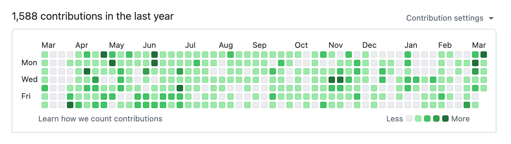

# 介绍

这是个人学习笔记论坛，不定时维护。

# 个人信息

<h4 align="center">
  <strong>
    <samp>
      I am <em>Eason</em>. I am a Blockchain developer... 
        Ethereum Solana Sui Ton lover.
        Rust Golang Typescript Python lover.
    </samp>
  </strong>
</h4>

[My Resume](/Eason-区块链后端工程师.pdf)

## 学习记录
个人的学习记录一般是：
- Github含有我的项目和所有笔记，以下是我的github的提交记录。

- CSDN有我平时项目中遇见的问题和解决方案。
- 详情请点击**右上方小图标**我的[Github](https://github.com/congmucc/note)和[CSDN](https://blog.csdn.net/m0_73419038?type=blog)和[stackoverflow](https://stackoverflow.com/users/23485085/congmu)

## 技术栈
### WEB3
- Solidity
- Move
> 框架
- Anchor
- Foundry

### 后端
- Golang
- Rust
- Python
- TypeScript
- Java

### 前端
- React

### Sql
- Mysql
- Redis
- PostgreSQL

### 其他
- CICD(Jenkins,Docker,K8s,Harbor)
- Linux
- Git

::: info
这里仅以语言为分界线，如Golang，包含但不限于Golang的生态，如rpc框架grpc，微服务框架Go-Zero，与合约交互框架Geth，sql框架Gorm，网络框架Gin等。 

还有一些框架: 
 
**The Graph, Alchemy, Pyth, Switchboard, Chainlink**
 
ElasticSearch, RabbitMQ, Kafka;
:::
