# MQ基础

## 介绍

MQ （MessageQueue），中文是消息队列，字面来看就是存放消息的队列。也就是事件驱动架构中的Broker。

异步通信的优点：

- 耦合度低

- 吞吐量提升

- 故障隔离

- 流量削峰

异步通信的缺点：

- 依赖于Broker的可靠性、安全性、吞吐能力

- 架构复杂了，业务没有明显的流程线，不好追踪管理


常见消息模型

|            | **RabbitMQ**            | **ActiveMQ**                   | **RocketMQ** | **Kafka**  |
| ---------- | ----------------------- | ------------------------------ | ------------ | ---------- |
| 公司/社区  | Rabbit                  | Apache                         | 阿里         | Apache     |
| 开发语言   | Erlang                  | Java                           | Java         | Scala&Java |
| 协议支持   | AMQP，XMPP，SMTP，STOMP | OpenWire,STOMP，REST,XMPP,AMQP | 自定义协议   | 自定义协议 |
| 可用性     | 高                      | 一般                           | 高           | 高         |
| 单机吞吐量 | 一般                    | 差                             | 高           | 非常高     |
| 消息延迟   | 微秒级                  | 毫秒级                         | 毫秒级       | 毫秒以内   |
| 消息可靠性 | 高                      | 一般                           | 高           | 一般       |


## 1 RabbitMQ快速入门

RabbitMQ概述和安装

本地安装看这个[RabbitMQ部署](./RabbitMQ安装/RabbitMQ部署指南.md)

快速入门

RabbitMQ中的几个概念：

- channel：操作MQ的工具

- exchange：路由消息到队列中

- queue：缓存消息

- virtual host：虚拟主机，是对queue、exchange等资源的逻辑分组

| English Term         | 中文术语   | Definition                                                   |
| -------------------- | ---------- | ------------------------------------------------------------ |
| RabbitMQ             | RabbitMQ   | RabbitMQ 是一个开源的消息队列系统，用于在应用程序之间传递消息，并实现解耦和异步通信。 |
| Exchange             | 交换机     | Exchange 用于接收发布到 RabbitMQ 的消息，并将其路由到一个或多个队列中。 |
| Queue                | 队列       | 队列用于存储发送到 RabbitMQ 的消息，等待消费者（Consumer）来消费。 |
| Producer             | 生产者     | 生产者（Producer）是向 RabbitMQ 发布消息的客户端应用程序，它负责生产并发送消息。 |
| Consumer             | 消费者     | 消费者（Consumer）是从 RabbitMQ 队列订阅并消费消息的客户端应用程序，它负责接收和处理消息。 |
| Binding              | 绑定       | 绑定（Binding）用于将交换机和队列关联起来，指定消息从交换机路由到哪个队列。 |
| Routing Key          | 路由键     | 路由键（Routing Key）是在发布消息时与消息一起发送的关键字，用于将消息路由到特定的队列。 |
| Connection           | 连接       | 连接（Connection）是生产者或消费者与 RabbitMQ 服务器之间的 TCP 连接，用于发送或接收消息。 |
| Channel              | 通道       | 通道（Channel）是在连接内打开的一个虚拟连接，用于进行消息的发送和接收。 |
| Acknowledgment (Ack) | 确认消息   | Acknowledgment（简称 Ack）是消费者接收到消息并成功处理后，向 RabbitMQ 发送的确认消息，表示消息已经被消费。 |
| Dead Letter Exchange | 死信交换机 | Dead Letter Exchange 用于接收无法被消费者处理的消息，并将这些消息重新路由到指定的队列中，以备后续处理。 |
| TTL (Time-To-Live)   | 生存时间   | TTL（Time-To-Live）是消息在队列中存活的最大时间，超过这个时间后消息会被丢弃或进入死信队列。 |
| Dead Letter Exchange | 死信交换机 | 死信交换机（Dead Letter Exchange）用于重新路由未能被消费者处理的消息，通常用于处理消息消费失败或超时的情况。 |
| Message | 消息 | 消息是在生产者和消费者之间传递的数据单元，它包含要传输的有效负载以及相关的元数据。 |

以上是 RabbitMQ 的一些基本概念及其中文术语的对应关系。

## 2 SpringAMQP

SpringAMQP是基于RabbitMQ封装的一套模板，并且还利用SpringBoot对其实现了自动装配，使用起来非常方便。

SpringAmqp的官方地址：https://spring.io/projects/spring-amqp


### 2.1 实现基础消息队列功能

> 1. 在父工程中引入spring-amqp的依赖
>
> 2. 在publisher服务中利用RabbitTemplate发送消息到simple.queue这个队列
>
> 3. 在consumer服务中编写消费逻辑，绑定simple.queue这个队列


1. **在父工程中引入spring-amqp的依赖**

   ```
           <!--AMQP依赖，包含RabbitMQ-->
           <dependency>
               <groupId>org.springframework.boot</groupId>
               <artifactId>spring-boot-starter-amqp</artifactId>
           </dependency>
   ```

   

2. **在publisher服务中利用RabbitTemplate发送消息到simple.queue这个队列**

   1. 在publisher服务中编写application.yml，添加mq连接信息

      ```
      spring:
        rabbitmq:
          host: 192.168.209.130 # 主机名
          port: 5672 # 端口
          virtual-host: / # 虚拟主机
          username: root # 用户名
          password: 123456 # 密码
      ```

   2. 在publisher服务中新建一个测试类，编写测试方法

      ```
      @SpringBootTest
      public class SpringAmqpTest {
          @Autowired
          private RabbitTemplate rabbitTemplate;
      
          @Test
          public void testSimpleQueue() {
              // 队列名称
              String queueName = "simple.queue";
              // 消息
              String message = "hello, spring amqp!";
              // 发送消息
              rabbitTemplate.convertAndSend(queueName, message);
          }
      }
      ```

      > 这里记得先创建一个名字为`simple.queue`的queue

3. **在consumer服务中编写消费逻辑，绑定simple.queue这个队列**

   1. 配置yml

      > 这里和publisher一样

   2. 编写listeners

      ```
      @Component
      public class SpringRabbitListener {
          // 利用RabbitListener来声明要监听的队列信息
          // 将来一旦监听的队列中有了消息，就会推送给当前服务，调用当前方法，处理消息。
          // 可以看到方法体中接收的就是消息体的内容
          @RabbitListener(queues = "simple.queue")
          public void listenSimpleQueueMessage(String msg) throws InterruptedException {
              System.out.println("spring 消费者接收到消息：【" + msg + "】");
          }
      }
      ```

      


### 2.2 WorkQueue模型

Work queues，任务模型。简单来说就是**让多个消费者绑定到一个队列，共同消费队列中的消息**。


当消息处理比较耗时的时候，可能生产消息的速度会远远大于消息的消费速度。长此以往，消息就会堆积越来越多，无法及时处理。

此时就可以使用work 模型，**多个消费者共同处理消息处理，消息处理的速度就能大大提高**了。

#### 2.2.1 消息发送

> 记得先加一个`work.queue`的队列

```
@Test
public void testWorkQueue() throws InterruptedException {
    String queueName = "work.queue";

    for (int i = 1; i <= 50; i++) {
        String message = "hello, worker,  message_" + i;
        rabbitTemplate.convertAndSend(queueName, message);
        Thread.sleep(10);
    }
}
```

#### 2.2.2 消息接收

```Java
@RabbitListener(queues = "work.queue")
public void listenWorkQueue1(String msg) throws InterruptedException {
    System.out.println("消费者1接收到消息：【" + msg + "】" + LocalTime.now());
    Thread.sleep(20);
}

@RabbitListener(queues = "work.queue")
public void listenWorkQueue2(String msg) throws InterruptedException {
    System.err.println("消费者2........接收到消息：【" + msg + "】" + LocalTime.now());
    Thread.sleep(200);
}
```

注意到这两消费者，都设置了`Thead.sleep`，模拟任务耗时：

- 消费者1 sleep了20毫秒，相当于每秒钟处理50个消息
- 消费者2 sleep了200毫秒，相当于每秒处理5个消息


#### 2.2.3 测试

启动ConsumerApplication后，在执行publisher服务中刚刚编写的发送测试方法testWorkQueue。

最终结果如下：

```Java
消费者1接收到消息：【hello, message_0】21:06:00.869555300
消费者2........接收到消息：【hello, message_1】21:06:00.884518
消费者1接收到消息：【hello, message_2】21:06:00.907454400
消费者1接收到消息：【hello, message_4】21:06:00.953332100
消费者1接收到消息：【hello, message_6】21:06:00.997867300
消费者1接收到消息：【hello, message_8】21:06:01.042178700
消费者2........接收到消息：【hello, message_3】21:06:01.086478800
消费者1接收到消息：【hello, message_10】21:06:01.087476600
消费者1接收到消息：【hello, message_12】21:06:01.132578300
消费者1接收到消息：【hello, message_14】21:06:01.175851200
消费者1接收到消息：【hello, message_16】21:06:01.218533400
消费者1接收到消息：【hello, message_18】21:06:01.261322900
消费者2........接收到消息：【hello, message_5】21:06:01.287003700
消费者1接收到消息：【hello, message_20】21:06:01.304412400
消费者1接收到消息：【hello, message_22】21:06:01.349950100
消费者1接收到消息：【hello, message_24】21:06:01.394533900
消费者1接收到消息：【hello, message_26】21:06:01.439876500
消费者1接收到消息：【hello, message_28】21:06:01.482937800
消费者2........接收到消息：【hello, message_7】21:06:01.488977100
消费者1接收到消息：【hello, message_30】21:06:01.526409300
消费者1接收到消息：【hello, message_32】21:06:01.572148
消费者1接收到消息：【hello, message_34】21:06:01.618264800
消费者1接收到消息：【hello, message_36】21:06:01.660780600
消费者2........接收到消息：【hello, message_9】21:06:01.689189300
消费者1接收到消息：【hello, message_38】21:06:01.705261
消费者1接收到消息：【hello, message_40】21:06:01.746927300
消费者1接收到消息：【hello, message_42】21:06:01.789835
消费者1接收到消息：【hello, message_44】21:06:01.834393100
消费者1接收到消息：【hello, message_46】21:06:01.875312100
消费者2........接收到消息：【hello, message_11】21:06:01.889969500
消费者1接收到消息：【hello, message_48】21:06:01.920702500
消费者2........接收到消息：【hello, message_13】21:06:02.090725900
消费者2........接收到消息：【hello, message_15】21:06:02.293060600
消费者2........接收到消息：【hello, message_17】21:06:02.493748
消费者2........接收到消息：【hello, message_19】21:06:02.696635100
消费者2........接收到消息：【hello, message_21】21:06:02.896809700
消费者2........接收到消息：【hello, message_23】21:06:03.099533400
消费者2........接收到消息：【hello, message_25】21:06:03.301446400
消费者2........接收到消息：【hello, message_27】21:06:03.504999100
消费者2........接收到消息：【hello, message_29】21:06:03.705702500
消费者2........接收到消息：【hello, message_31】21:06:03.906601200
消费者2........接收到消息：【hello, message_33】21:06:04.108118500
消费者2........接收到消息：【hello, message_35】21:06:04.308945400
消费者2........接收到消息：【hello, message_37】21:06:04.511547700
消费者2........接收到消息：【hello, message_39】21:06:04.714038400
消费者2........接收到消息：【hello, message_41】21:06:04.916192700
消费者2........接收到消息：【hello, message_43】21:06:05.116286400
消费者2........接收到消息：【hello, message_45】21:06:05.318055100
消费者2........接收到消息：【hello, message_47】21:06:05.520656400
消费者2........接收到消息：【hello, message_49】21:06:05.723106700
```

可以看到消费者1和消费者2竟然每人消费了25条消息：

- 消费者1很快完成了自己的25条消息
- 消费者2却在缓慢的处理自己的25条消息。

也就是说消息是平均分配给每个消费者，并没有考虑到消费者的处理能力。导致1个消费者空闲，另一个消费者忙的不可开交。没有充分利用每一个消费者的能力，最终消息处理的耗时远远超过了1秒。这样显然是有问题的。

#### 2.2.4 能者多劳

在spring中有一个简单的配置，可以解决这个问题。我们修改consumer服务的application.yml文件，添加配置：

```YAML
spring:
  rabbitmq:
    listener:
      simple:
        prefetch: 1 # 每次只能获取一条消息，处理完成才能获取下一个消息
```

再次测试，发现结果如下：

```Java
消费者1接收到消息：【hello, message_0】21:12:51.659664200
消费者2........接收到消息：【hello, message_1】21:12:51.680610
消费者1接收到消息：【hello, message_2】21:12:51.703625
消费者1接收到消息：【hello, message_3】21:12:51.724330100
消费者1接收到消息：【hello, message_4】21:12:51.746651100
消费者1接收到消息：【hello, message_5】21:12:51.768401400
消费者1接收到消息：【hello, message_6】21:12:51.790511400
消费者1接收到消息：【hello, message_7】21:12:51.812559800
消费者1接收到消息：【hello, message_8】21:12:51.834500600
消费者1接收到消息：【hello, message_9】21:12:51.857438800
消费者1接收到消息：【hello, message_10】21:12:51.880379600
消费者2........接收到消息：【hello, message_11】21:12:51.899327100
消费者1接收到消息：【hello, message_12】21:12:51.922828400
消费者1接收到消息：【hello, message_13】21:12:51.945617400
消费者1接收到消息：【hello, message_14】21:12:51.968942500
消费者1接收到消息：【hello, message_15】21:12:51.992215400
消费者1接收到消息：【hello, message_16】21:12:52.013325600
消费者1接收到消息：【hello, message_17】21:12:52.035687100
消费者1接收到消息：【hello, message_18】21:12:52.058188
消费者1接收到消息：【hello, message_19】21:12:52.081208400
消费者2........接收到消息：【hello, message_20】21:12:52.103406200
消费者1接收到消息：【hello, message_21】21:12:52.123827300
消费者1接收到消息：【hello, message_22】21:12:52.146165100
消费者1接收到消息：【hello, message_23】21:12:52.168828300
消费者1接收到消息：【hello, message_24】21:12:52.191769500
消费者1接收到消息：【hello, message_25】21:12:52.214839100
消费者1接收到消息：【hello, message_26】21:12:52.238998700
消费者1接收到消息：【hello, message_27】21:12:52.259772600
消费者1接收到消息：【hello, message_28】21:12:52.284131800
消费者2........接收到消息：【hello, message_29】21:12:52.306190600
消费者1接收到消息：【hello, message_30】21:12:52.325315800
消费者1接收到消息：【hello, message_31】21:12:52.347012500
消费者1接收到消息：【hello, message_32】21:12:52.368508600
消费者1接收到消息：【hello, message_33】21:12:52.391785100
消费者1接收到消息：【hello, message_34】21:12:52.416383800
消费者1接收到消息：【hello, message_35】21:12:52.439019
消费者1接收到消息：【hello, message_36】21:12:52.461733900
消费者1接收到消息：【hello, message_37】21:12:52.485990
消费者1接收到消息：【hello, message_38】21:12:52.509219900
消费者2........接收到消息：【hello, message_39】21:12:52.523683400
消费者1接收到消息：【hello, message_40】21:12:52.547412100
消费者1接收到消息：【hello, message_41】21:12:52.571191800
消费者1接收到消息：【hello, message_42】21:12:52.593024600
消费者1接收到消息：【hello, message_43】21:12:52.616731800
消费者1接收到消息：【hello, message_44】21:12:52.640317
消费者1接收到消息：【hello, message_45】21:12:52.663111100
消费者1接收到消息：【hello, message_46】21:12:52.686727
消费者1接收到消息：【hello, message_47】21:12:52.709266500
消费者2........接收到消息：【hello, message_48】21:12:52.725884900
消费者1接收到消息：【hello, message_49】21:12:52.746299900
```

可以发现，由于消费者1处理速度较快，所以处理了更多的消息；消费者2处理速度较慢，只处理了6条消息。而最终总的执行耗时也在1秒左右，大大提升。

正所谓能者多劳，这样充分利用了每一个消费者的处理能力，可以有效避免消息积压问题。


#### 2.2.5 总结

Work模型的使用：

- 多个消费者绑定到一个队列，同一条消息只会被一个消费者处理
- 通过设置prefetch来控制消费者预取的消息数量


### 2.3 交换机类型

在之前的两个测试案例中，都没有交换机，生产者直接发送消息到队列。而一旦引入交换机，消息发送的模式会有很大变化：

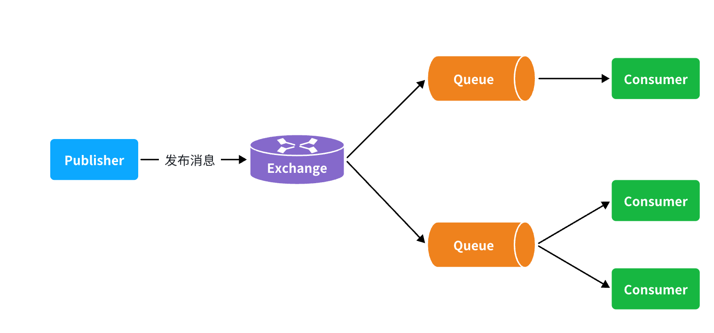

可以看到，在订阅模型中，多了一个exchange角色，而且过程略有变化：

- **Publisher**：生产者，不再发送消息到队列中，而是发给交换机
- **Exchange**：交换机，一方面，接收生产者发送的消息。另一方面，知道如何处理消息，例如递交给某个特别队列、递交给所有队列、或是将消息丢弃。到底如何操作，取决于Exchange的类型。
- **Queue**：消息队列也与以前一样，接收消息、缓存消息。不过队列一定要与交换机绑定。
- **Consumer**：消费者，与以前一样，订阅队列，没有变化

**Exchange（** **交换机** **）只负责转发消息，不具备存储消息的能力**，因此如果没有任何队列与Exchange绑定，或者没有符合路由规则的队列，那么消息会丢失！

交换机的类型有四种：

- **Fanout**：广播，将消息交给所有绑定到交换机的队列。我们最早在控制台使用的正是Fanout交换机
- **Direct**：订阅，基于RoutingKey（路由key）发送给订阅了消息的队列
- **Topic**：通配符订阅，与Direct类似，只不过RoutingKey可以使用通配符
- **Headers**：头匹配，基于MQ的消息头匹配，用的较少。

> 为什么会有交换机，举个场景，当一个支付成功的消息来到后端，不能只有一个消费者收到，而且到了后期会有集群，会有多个微服务，一个消息需要多个队列，所以说出现了交换机。


### 2.4 Fanout交换机

在广播模式下，消息发送流程是这样的：


#### 2.4.1 声明队列和交换机

- 交换机


- 队列


- 然后绑定两个队列到交换机：

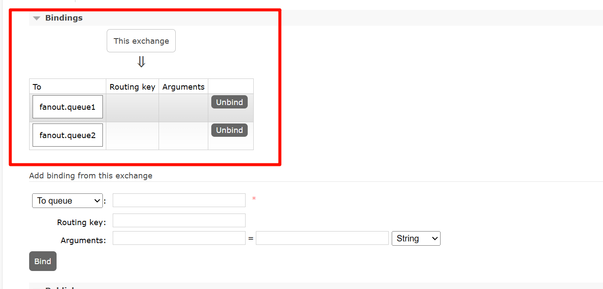

#### 2.4.2 消息发送

在publisher服务的SpringAmqpTest类中添加测试方法：

```java
@Test
public void testFanoutQueue() {
    // 交换机名称
    String exchangeName = "root.fanout";
    String message = "hello, everyone!";
    // 发送消息
    rabbitTemplate.convertAndSend(exchangeName, "", message);
}
```

#### 2.4.3 消息接收

在consumer服务的SpringRabbitListener中添加两个方法，作为消费者

```java
@RabbitListener(queues = "fanout.queue1")
public void listenFanoutQueue1(String msg) throws InterruptedException {
    System.err.println("消费者1........接收到fanout消息：【" + msg + "】" + LocalTime.now());
}

@RabbitListener(queues = "fanout.queue2")
public void listenFanoutQueue2(String msg) throws InterruptedException {
    System.err.println("消费者2........接收到fanout消息：【" + msg + "】" + LocalTime.now());
}
```


#### 2.4.4 总结

交换机的作用是什么？

- 接收publisher发送的消息
- 将消息按照规则路由到与之绑定的队列
- 不能缓存消息，路由失败，消息丢失
- FanoutExchange的会将消息路由到每个绑定的队列


### 2.5 Direct交换机

在Fanout模式中，一条消息，会被所有订阅的队列都消费。但是，在某些场景下，我们希望不同的消息被不同的队列消费。这时就要用到Direct类型的Exchange。


在Direct模型下：

- 队列与交换机的绑定，不能是任意绑定了，而是要指定一个`RoutingKey`（路由key）
- 消息的发送方在 向 Exchange发送消息时，也必须指定消息的 `RoutingKey`。
- Exchange不再把消息交给每一个绑定的队列，而是根据消息的`Routing Key`进行判断，只有队列的`Routingkey`与消息的 `Routing key`完全一致，才会接收到消息

#### 需求：按照上图所示

1.  声明一个名为`hmall.direct`的交换机
2. 声明队列`direct.queue1`，绑定`hmall.direct`，`bindingKey`为`blud`和`red`
3. 声明队列`direct.queue2`，绑定`hmall.direct`，`bindingKey`为`yellow`和`red`
4.  在`consumer`服务中，编写两个消费者方法，分别监听direct.queue1和direct.queue2 
5.  在publisher中编写测试方法，向`hmall.direct`发送消息 

#### 2.5.1 声明队列和交换机

> 步骤：
>
> 1. 声明交换机
> 2. 声明队列
> 3. 将队列绑定到交换机上

- 交换机


- 队列

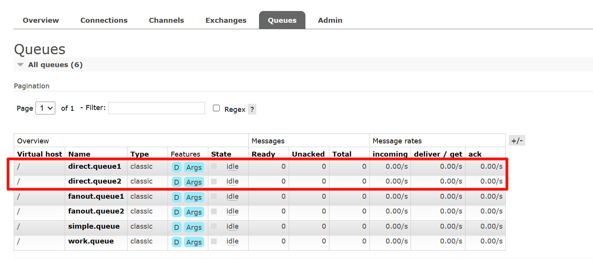


- 然后使用`red`和`blue`作为key，**绑定**`direct.queue1`到`root.direct`：

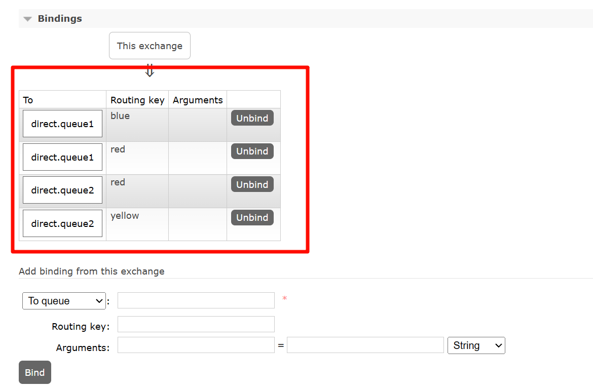


#### 2.5.2 消息发送

- 在publisher服务的SpringAmqpTest类中添加测试方法：

```java
@Test
public void testDirectQueue() throws InterruptedException {
    // 交换机名称
    String exchangeName = "root.direct";
    String message = "hello, blue!";
    // 发送消息

    rabbitTemplate.convertAndSend(exchangeName, "blue", message);
    Thread.sleep(20);
    message = "hello, yellow!";
    rabbitTemplate.convertAndSend(exchangeName, "yellow", message);
    Thread.sleep(20);
    message = "hello, red!";
    rabbitTemplate.convertAndSend(exchangeName, "red", message);
}
```

#### 2.5.3 消息接收

- 在consumer服务的SpringRabbitListener中添加方法：

```java
@RabbitListener(queues = "direct.queue1")
public void listenDirectQueue1(String msg) throws InterruptedException {
    System.err.println("消费者1........接收到direct消息：【" + msg + "】" + LocalTime.now());
}

@RabbitListener(queues = "direct.queue2")
public void listenDirectQueue2(String msg) throws InterruptedException {
    System.err.println("消费者2........接收到direct消息：【" + msg + "】" + LocalTime.now());
}
```

- 接收结果如下


> 这里我们可以知道的是当设置了key的时候，只有对应有相应的key的队列才会被Direct交换机发送消息

#### 2.5.4.总结

描述下Direct交换机与Fanout交换机的差异？

- Fanout交换机将消息路由给每一个与之绑定的队列
- Direct交换机根据RoutingKey判断路由给哪个队列
- 如果多个队列具有相同的RoutingKey，则与Fanout功能类似


### 2.6 Topic交换机

#### 2.6.1 说明

`Topic`类型的`Exchange`与`Direct`相比，都是可以根据`RoutingKey`把消息路由到不同的队列。

只不过`Topic`类型`Exchange`可以让队列在绑定`BindingKey` 的时候使用通配符！

```
BindingKey` 一般都是有一个或多个单词组成，多个单词之间以`.`分割，例如： `item.insert
```

通配符规则：

- `#`：匹配一个或多个词
- `*`：匹配不多不少恰好1个词

举例：

- `item.#`：能够匹配`item.spu.insert` 或者 `item.spu`
- `item.*`：只能匹配`item.spu`

图示：


假如此时publisher发送的消息使用的`RoutingKey`共有四种：

- `china.news `代表有中国的新闻消息；
- `china.weather` 代表中国的天气消息；
- `japan.news` 则代表日本新闻
- `japan.weather` 代表日本的天气消息；

解释：

- `topic.queue1`：绑定的是`china.#` ，凡是以 `china.`开头的`routing key` 都会被匹配到，包括：
  - `china.news`
  - `china.weather`
- `topic.queue2`：绑定的是`#.news` ，凡是以 `.news`结尾的 `routing key` 都会被匹配。包括:
  - `china.news`
  - `japan.news`


#### 2.6.2 声明队列和交换机

- 队列

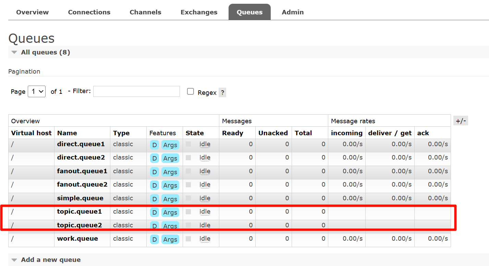

- 交换机


- 绑定


#### 2.6.3 消息发送

- 在publisher服务的SpringAmqpTest类中添加测试方法：

```java
@Test
public void testTopicQueue() {
    // 交换机名称
    String exchangeName = "root.topic";
    String message = "hello, china.weather";
    rabbitTemplate.convertAndSend(exchangeName, "china.weather", message);
    message = "hello, china.news";
    rabbitTemplate.convertAndSend(exchangeName, "china.news", message);
    message = "hello, japan.news";
    rabbitTemplate.convertAndSend(exchangeName, "japan.news", message);
}
```


#### 2.6.4 消息接收

- 在consumer服务的SpringRabbitListener中添加方法：

```java
@RabbitListener(queues = "topic.queue1")
public void listenTopicQueue1(String msg) throws InterruptedException {
    System.err.println("消费者1........接收到topic消息：【" + msg + "】" + LocalTime.now());
}

@RabbitListener(queues = "topic.queue2")
public void listenTopicQueue2(String msg) throws InterruptedException {
    System.err.println("消费者2........接收到topic消息：【" + msg + "】" + LocalTime.now());
}
```


结果如下：

```java
消费者2........接收到topic消息：【hello, china.news】01:14:44.393
消费者1........接收到topic消息：【hello, china.weather】01:14:44.393
消费者2........接收到topic消息：【hello, japan.news】01:14:44.394
消费者1........接收到topic消息：【hello, china.news】01:14:44.394
```


### 2.7 利用java声明队列和交换机

在之前我们都是基于RabbitMQ控制台来创建队列、交换机。但是在实际开发时，队列和交换机是程序员定义的，将来项目上线，又要交给运维去创建。那么程序员就需要把程序中运行的所有队列和交换机都写下来，交给运维。在这个过程中是很容易出现错误的。

因此推荐的做法是由程序启动时检查队列和交换机是否存在，如果不存在自动创建。

#### 2.7.1 基本API

SpringAMQP提供了一个Queue类，用来创建队列：


SpringAMQP还提供了一个Exchange接口，来表示所有不同类型的交换机：


我们可以自己创建队列和交换机，不过SpringAMQP还提供了ExchangeBuilder来简化这个过程：


而在绑定队列和交换机时，则需要使用BindingBuilder来创建Binding对象：


#### 2.7.2 fanout示例

在consumer中创建一个类，声明队列和交换机：

```Java
package com.itheima.consumer.config;

import org.springframework.amqp.core.Binding;
import org.springframework.amqp.core.BindingBuilder;
import org.springframework.amqp.core.FanoutExchange;
import org.springframework.amqp.core.Queue;
import org.springframework.context.annotation.Bean;
import org.springframework.context.annotation.Configuration;

@Configuration
public class FanoutConfig {
    /**
     * 声明交换机
     * @return Fanout类型交换机
     */
    @Bean
    public FanoutExchange fanoutExchange(){
        return new FanoutExchange("hmall.fanout");
    }

    /**
     * 第1个队列
     */
    @Bean
    public Queue fanoutQueue1(){
        return new Queue("fanout.queue1");
    }

    /**
     * 绑定队列和交换机
     */
    @Bean
    public Binding bindingQueue1(Queue fanoutQueue1, FanoutExchange fanoutExchange){
        return BindingBuilder.bind(fanoutQueue1).to(fanoutExchange);
    }

    /**
     * 第2个队列
     */
    @Bean
    public Queue fanoutQueue2(){
        return new Queue("fanout.queue2");
    }

    /**
     * 绑定队列和交换机
     */
    @Bean
    public Binding bindingQueue2(Queue fanoutQueue2, FanoutExchange fanoutExchange){
        return BindingBuilder.bind(fanoutQueue2).to(fanoutExchange);
    }
}
```

#### 2.7.3 direct示例

direct模式由于要绑定多个KEY，会非常麻烦，每一个Key都要编写一个binding：

```Java
package com.itheima.consumer.config;

import org.springframework.amqp.core.*;
import org.springframework.context.annotation.Bean;
import org.springframework.context.annotation.Configuration;

@Configuration
public class DirectConfig {

    /**
     * 声明交换机
     * @return Direct类型交换机
     */
    @Bean
    public DirectExchange directExchange(){
        return ExchangeBuilder.directExchange("hmall.direct").build();
    }

    /**
     * 第1个队列
     */
    @Bean
    public Queue directQueue1(){
        return new Queue("direct.queue1");
    }

    /**
     * 绑定队列和交换机
     */
    @Bean
    public Binding bindingQueue1WithRed(Queue directQueue1, DirectExchange directExchange){
        return BindingBuilder.bind(directQueue1).to(directExchange).with("red");
    }
    /**
     * 绑定队列和交换机
     */
    @Bean
    public Binding bindingQueue1WithBlue(Queue directQueue1, DirectExchange directExchange){
        return BindingBuilder.bind(directQueue1).to(directExchange).with("blue");
    }

    /**
     * 第2个队列
     */
    @Bean
    public Queue directQueue2(){
        return new Queue("direct.queue2");
    }

    /**
     * 绑定队列和交换机
     */
    @Bean
    public Binding bindingQueue2WithRed(Queue directQueue2, DirectExchange directExchange){
        return BindingBuilder.bind(directQueue2).to(directExchange).with("red");
    }
    /**
     * 绑定队列和交换机
     */
    @Bean
    public Binding bindingQueue2WithYellow(Queue directQueue2, DirectExchange directExchange){
        return BindingBuilder.bind(directQueue2).to(directExchange).with("yellow");
    }
}
```

#### 2.7.4 基于注解声明

基于@Bean的方式声明队列和交换机比较麻烦，Spring还提供了基于注解方式来声明。

例如，我们同样声明Direct模式的交换机和队列：

- 这个是在消费者的监听器定义的

```Java
@RabbitListener(bindings = @QueueBinding(
    value = @Queue(name = "direct.queue1"),
    exchange = @Exchange(name = "hmall.direct", type = ExchangeTypes.DIRECT),
    key = {"red", "blue"}
))
public void listenDirectQueue1(String msg){
    System.out.println("消费者1接收到direct.queue1的消息：【" + msg + "】");
}

@RabbitListener(bindings = @QueueBinding(
    value = @Queue(name = "direct.queue2"),
    exchange = @Exchange(name = "hmall.direct", type = ExchangeTypes.DIRECT),
    key = {"red", "yellow"}
))
public void listenDirectQueue2(String msg){
    System.out.println("消费者2接收到direct.queue2的消息：【" + msg + "】");
}
```


**Topic模式：**

```Java
@RabbitListener(bindings = @QueueBinding(
    value = @Queue(name = "topic.queue1"),
    exchange = @Exchange(name = "hmall.topic", type = ExchangeTypes.TOPIC),
    key = "china.#"
))
public void listenTopicQueue1(String msg){
    System.out.println("消费者1接收到topic.queue1的消息：【" + msg + "】");
}

@RabbitListener(bindings = @QueueBinding(
    value = @Queue(name = "topic.queue2"),
    exchange = @Exchange(name = "hmall.topic", type = ExchangeTypes.TOPIC),
    key = "#.news"
))
public void listenTopicQueue2(String msg){
    System.out.println("消费者2接收到topic.queue2的消息：【" + msg + "】");
}
```


### 2.8 消息转换器

Spring的消息发送代码接收的消息体是一个Object：

而在数据传输时，它会把你发送的消息序列化为字节发送给MQ，接收消息的时候，还会把字节反序列化为Java对象。

只不过，默认情况下Spring采用的序列化方式是JDK序列化。众所周知，JDK序列化存在下列问题：

- 数据体积过大
- 有安全漏洞
- 可读性差


#### 2.8.1 测试默认转换器

1）创建测试队列

首先，我们在consumer服务中声明一个新的配置类：


利用@Bean的方式创建一个队列，

具体代码：

```Java
package com.itheima.consumer.config;

import org.springframework.amqp.core.Queue;
import org.springframework.context.annotation.Bean;
import org.springframework.context.annotation.Configuration;

@Configuration
public class MessageConfig {

    @Bean
    public Queue objectQueue() {
        return new Queue("object.queue");
    }
}
```

注意，这里我们先不要给这个队列添加消费者，我们要查看消息体的格式。

重启consumer服务以后，该队列就会被自动创建出来了：


2）发送消息

我们在publisher模块的SpringAmqpTest中新增一个消息发送的代码，发送一个Map对象：

```Java
@Test
public void testSendMap() throws InterruptedException {
    // 准备消息
    Map<String,Object> msg = new HashMap<>();
    msg.put("name", "柳岩");
    msg.put("age", 21);
    // 发送消息
    rabbitTemplate.convertAndSend("object.queue", msg);
}
```

发送消息后查看控制台：

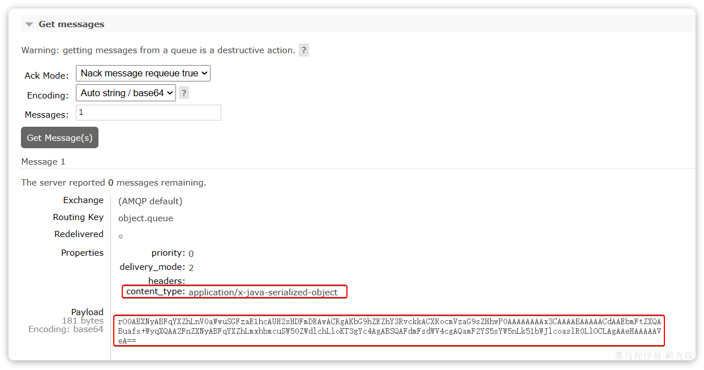

可以看到消息格式非常不友好。

#### 2.8.2 配置JSON转换器

显然，JDK序列化方式并不合适。我们希望消息体的体积更小、可读性更高，因此可以使用JSON方式来做序列化和反序列化。

在`publisher`和`consumer`两个服务中都引入依赖：

```XML
<dependency>
    <groupId>com.fasterxml.jackson.dataformat</groupId>
    <artifactId>jackson-dataformat-xml</artifactId>
    <version>2.9.10</version>
</dependency>
```

注意，如果项目中引入了`spring-boot-starter-web`依赖，则无需再次引入`Jackson`依赖。

配置消息转换器，在`publisher`和`consumer`两个服务的启动类中添加一个Bean即可：

```Java
@Bean
public MessageConverter messageConverter(){
    // 1.定义消息转换器
    Jackson2JsonMessageConverter jackson2JsonMessageConverter = new Jackson2JsonMessageConverter();
    // 2.配置自动创建消息id，用于识别不同消息，也可以在业务中基于ID判断是否是重复消息
    jackson2JsonMessageConverter.setCreateMessageIds(true);
    return jackson2JsonMessageConverter;
}
```

消息转换器中添加的messageId可以便于我们将来做幂等性判断。

此时，我们到MQ控制台**删除**`object.queue`中的旧的消息。然后再次执行刚才的消息发送的代码，到MQ的控制台查看消息结构：


#### 2.8.3 消费者接收Object

我们在consumer服务中定义一个新的消费者，publisher是用Map发送，那么消费者也一定要用Map接收，格式如下：

```Java
@RabbitListener(queues = "object.queue")
public void listenSimpleQueueMessage(Map<String, Object> msg) throws InterruptedException {
    System.out.println("消费者接收到object.queue消息：【" + msg + "】");
}
```


# MQ高级

# 1.发送者的可靠性

首先，我们一起分析一下消息丢失的可能性有哪些。
消息从发送者发送消息，到消费者处理消息，需要经过的流程是这样的：

消息从生产者到消费者的每一步都可能导致消息丢失：

- 发送消息时丢失：
  - 生产者发送消息时连接MQ失败
  - 生产者发送消息到达MQ后未找到`Exchange`
  - 生产者发送消息到达MQ的`Exchange`后，未找到合适的`Queue`
  - 消息到达MQ后，处理消息的进程发生异常
- MQ导致消息丢失：
  - 消息到达MQ，保存到队列后，尚未消费就突然宕机
- 消费者处理消息时：
  - 消息接收后尚未处理突然宕机
  - 消息接收后处理过程中抛出异常

综上，我们要解决消息丢失问题，保证MQ的可靠性，就必须从3个方面入手：

- 确保生产者一定把消息发送到MQ
- 确保MQ不会将消息弄丢
- 确保消费者一定要处理消息

这一章我们先来看如何确保生产者一定能把消息发送到MQ。

## 1.1.生产者重试机制

首先第一种情况，就是生产者发送消息时，出现了网络故障，导致与MQ的连接中断。

为了解决这个问题，SpringAMQP提供的消息发送时的重试机制。即：当`RabbitTemplate`与MQ连接超时后，多次重试。

修改`publisher`模块的`application.yaml`文件，添加下面的内容：

```yaml
spring:
  rabbitmq:
    connection-timeout: 1s # 设置MQ的连接超时时间
    template:
      retry:
        enabled: true # 开启超时重试机制
        initial-interval: 1000ms # 失败后的初始等待时间
        multiplier: 1 # 失败后下次的等待时长倍数，下次等待时长 = initial-interval * multiplier
        max-attempts: 3 # 最大重试次数
```

我们利用命令停掉RabbitMQ服务：

```shell
docker stop mq
```

然后测试发送一条消息，会发现会每隔1秒重试1次，总共重试了3次。消息发送的超时重试机制配置成功了！

:::warning
**注意**：当网络不稳定的时候，利用重试机制可以有效提高消息发送的成功率。不过SpringAMQP提供的重试机制是**阻塞式**的重试，也就是说多次重试等待的过程中，当前线程是被阻塞的。
如果对于业务性能有要求，建议禁用重试机制。如果一定要使用，请合理配置等待时长和重试次数，当然也可以考虑使用异步线程来执行发送消息的代码。
:::

## 1.2.生产者确认机制

一般情况下，只要生产者与MQ之间的网路连接顺畅，基本不会出现发送消息丢失的情况，因此大多数情况下我们无需考虑这种问题。
不过，在少数情况下，也会出现消息发送到MQ之后丢失的现象，比如：

- MQ内部处理消息的进程发生了异常
- 生产者发送消息到达MQ后未找到`Exchange`
- 生产者发送消息到达MQ的`Exchange`后，未找到合适的`Queue`，因此无法路由

针对上述情况，RabbitMQ提供了生产者消息确认机制，包括`Publisher Confirm`和`Publisher Return`两种。在开启确认机制的情况下，当生产者发送消息给MQ后，MQ会根据消息处理的情况返回不同的**回执**。
具体如图所示：

总结如下：

- 当消息投递到MQ，但是路由失败时，通过**Publisher Return**返回异常信息，同时返回ack的确认信息，代表投递成功
- 临时消息投递到了MQ，并且入队成功，返回ACK，告知投递成功
- 持久消息投递到了MQ，并且入队完成持久化，返回ACK ，告知投递成功
- 其它情况都会返回NACK，告知投递失败


其中`ack`和`nack`属于**Publisher Confirm**机制，`ack`是投递成功；`nack`是投递失败。而`return`则属于**Publisher Return**机制。
默认两种机制都是关闭状态，需要通过配置文件来开启。

## 1.3.实现生产者确认

### 1.3.1.开启生产者确认

在publisher模块的`application.yaml`中添加配置：

```yaml
spring:
  rabbitmq:
    publisher-confirm-type: correlated # 开启publisher confirm机制，并设置confirm类型
    publisher-returns: true # 开启publisher return机制
```

这里`publisher-confirm-type`有三种模式可选：

- `none`：关闭confirm机制
- `simple`：同步阻塞等待MQ的回执
- `correlated`：MQ异步回调返回回执

一般我们推荐使用`correlated`，回调机制。

### 1.3.2.定义ReturnCallback

每个`RabbitTemplate`只能配置一个`ReturnCallback`，因此我们可以在配置类中统一设置。我们在publisher模块定义一个配置类：

内容如下：

```java
package com.itheima.publisher.config;

import lombok.AllArgsConstructor;
import lombok.extern.slf4j.Slf4j;
import org.springframework.amqp.core.ReturnedMessage;
import org.springframework.amqp.rabbit.core.RabbitTemplate;
import org.springframework.context.annotation.Configuration;

import javax.annotation.PostConstruct;

@Slf4j
@AllArgsConstructor
@Configuration
public class MqConfig {
    private final RabbitTemplate rabbitTemplate;

    @PostConstruct
    public void init(){
        rabbitTemplate.setReturnsCallback(new RabbitTemplate.ReturnsCallback() {
            @Override
            public void returnedMessage(ReturnedMessage returned) {
                log.error("触发return callback,");
                log.debug("exchange: {}", returned.getExchange());
                log.debug("routingKey: {}", returned.getRoutingKey());
                log.debug("message: {}", returned.getMessage());
                log.debug("replyCode: {}", returned.getReplyCode());
                log.debug("replyText: {}", returned.getReplyText());
            }
        });
    }
}
```

### 1.3.3.定义ConfirmCallback

由于每个消息发送时的处理逻辑不一定相同，因此ConfirmCallback需要在每次发消息时定义。具体来说，是在调用RabbitTemplate中的convertAndSend方法时，多传递一个参数：

这里的CorrelationData中包含两个核心的东西：

- `id`：消息的唯一标示，MQ对不同的消息的回执以此做判断，避免混淆
- `SettableListenableFuture`：回执结果的Future对象

将来MQ的回执就会通过这个`Future`来返回，我们可以提前给`CorrelationData`中的`Future`添加回调函数来处理消息回执：


我们新建一个测试，向系统自带的交换机发送消息，并且添加`ConfirmCallback`：

```java
@Test
void testPublisherConfirm() {
    // 1.创建CorrelationData
    CorrelationData cd = new CorrelationData();
    // 2.给Future添加ConfirmCallback
    cd.getFuture().addCallback(new ListenableFutureCallback<CorrelationData.Confirm>() {
        @Override
        public void onFailure(Throwable ex) {
            // 2.1.Future发生异常时的处理逻辑，基本不会触发
            log.error("send message fail", ex);
        }
        @Override
        public void onSuccess(CorrelationData.Confirm result) {
            // 2.2.Future接收到回执的处理逻辑，参数中的result就是回执内容
            if(result.isAck()){ // result.isAck()，boolean类型，true代表ack回执，false 代表 nack回执
                log.debug("发送消息成功，收到 ack!");
            }else{ // result.getReason()，String类型，返回nack时的异常描述
                log.error("发送消息失败，收到 nack, reason : {}", result.getReason());
            }
        }
    });
    // 3.发送消息
    rabbitTemplate.convertAndSend("hmall.direct", "q", "hello", cd);
}
```

执行结果如下：

可以看到，由于传递的`RoutingKey`是错误的，路由失败后，触发了`return callback`，同时也收到了ack。
当我们修改为正确的`RoutingKey`以后，就不会触发`return callback`了，只收到ack。
而如果连交换机都是错误的，则只会收到nack。

:::warning
**注意**：
开启生产者确认比较消耗MQ性能，一般不建议开启。而且大家思考一下触发确认的几种情况：

- 路由失败：一般是因为RoutingKey错误导致，往往是编程导致
- 交换机名称错误：同样是编程错误导致
- MQ内部故障：这种需要处理，但概率往往较低。因此只有对消息可靠性要求非常高的业务才需要开启，而且仅仅需要开启ConfirmCallback处理nack就可以了。
  :::

# 2.MQ的可靠性

消息到达MQ以后，如果MQ不能及时保存，也会导致消息丢失，所以MQ的可靠性也非常重要。

## 2.1.数据持久化

为了提升性能，默认情况下MQ的数据都是在内存存储的临时数据，重启后就会消失。为了保证数据的可靠性，必须配置数据持久化，包括：

- 交换机持久化
- 队列持久化
- 消息持久化

我们以控制台界面为例来说明。

### 2.1.1.交换机持久化

在控制台的`Exchanges`页面，添加交换机时可以配置交换机的`Durability`参数：
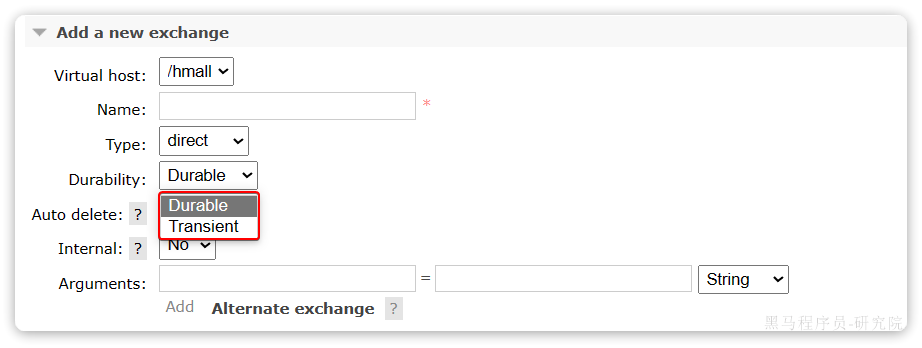
设置为`Durable`就是持久化模式，`Transient`就是临时模式。

### 2.1.2.队列持久化

在控制台的Queues页面，添加队列时，同样可以配置队列的`Durability`参数：

除了持久化以外，你可以看到队列还有很多其它参数，有一些我们会在后期学习。

### 2.1.3.消息持久化

在控制台发送消息的时候，可以添加很多参数，而消息的持久化是要配置一个`properties`：


:::warning
**说明**：在开启持久化机制以后，如果同时还开启了生产者确认，那么MQ会在消息持久化以后才发送ACK回执，进一步确保消息的可靠性。
不过出于性能考虑，为了减少IO次数，发送到MQ的消息并不是逐条持久化到数据库的，而是每隔一段时间批量持久化。一般间隔在100毫秒左右，这就会导致ACK有一定的延迟，因此建议生产者确认全部采用异步方式。
:::

## 2.2.LazyQueue

在默认情况下，RabbitMQ会将接收到的信息保存在内存中以降低消息收发的延迟。但在某些特殊情况下，这会导致消息积压，比如：

- 消费者宕机或出现网络故障
- 消息发送量激增，超过了消费者处理速度
- 消费者处理业务发生阻塞

一旦出现消息堆积问题，RabbitMQ的内存占用就会越来越高，直到触发内存预警上限。此时RabbitMQ会将内存消息刷到磁盘上，这个行为成为`PageOut`. `PageOut`会耗费一段时间，并且会阻塞队列进程。因此在这个过程中RabbitMQ不会再处理新的消息，生产者的所有请求都会被阻塞。

为了解决这个问题，从RabbitMQ的3.6.0版本开始，就增加了Lazy Queues的模式，也就是惰性队列。惰性队列的特征如下：

- 接收到消息后直接存入磁盘而非内存
- 消费者要消费消息时才会从磁盘中读取并加载到内存（也就是懒加载）
- 支持数百万条的消息存储

而在3.12版本之后，LazyQueue已经成为所有队列的默认格式。因此官方推荐升级MQ为3.12版本或者所有队列都设置为LazyQueue模式。

### 2.2.1.控制台配置Lazy模式

在添加队列的时候，添加`x-queue-mod=lazy`参数即可设置队列为Lazy模式：
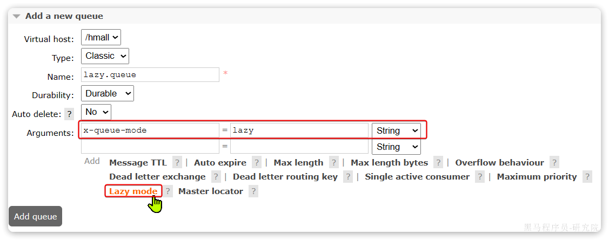

### 2.2.2.代码配置Lazy模式

在利用SpringAMQP声明队列的时候，添加`x-queue-mod=lazy`参数也可设置队列为Lazy模式：

```java
@Bean
public Queue lazyQueue(){
    return QueueBuilder
            .durable("lazy.queue")
            .lazy() // 开启Lazy模式
            .build();
}
```

这里是通过`QueueBuilder`的`lazy()`函数配置Lazy模式，底层源码如下：


当然，我们也可以基于注解来声明队列并设置为Lazy模式：

```java
@RabbitListener(queuesToDeclare = @Queue(
        name = "lazy.queue",
        durable = "true",
        arguments = @Argument(name = "x-queue-mode", value = "lazy")
))
public void listenLazyQueue(String msg){
    log.info("接收到 lazy.queue的消息：{}", msg);
}
```

### 2.2.3.更新已有队列为lazy模式

对于已经存在的队列，也可以配置为lazy模式，但是要通过设置policy实现。
可以基于命令行设置policy：

```shell
rabbitmqctl set_policy Lazy "^lazy-queue$" '{"queue-mode":"lazy"}' --apply-to queues  
```

命令解读：

- `rabbitmqctl` ：RabbitMQ的命令行工具
- `set_policy` ：添加一个策略
- `Lazy` ：策略名称，可以自定义
- `"^lazy-queue$"` ：用正则表达式匹配队列的名字
- `'{"queue-mode":"lazy"}'` ：设置队列模式为lazy模式
- `--apply-to queues`：策略的作用对象，是所有的队列

当然，也可以在控制台配置policy，进入在控制台的`Admin`页面，点击`Policies`，即可添加配置：


# 3.消费者的可靠性

当RabbitMQ向消费者投递消息以后，需要知道消费者的处理状态如何。因为消息投递给消费者并不代表就一定被正确消费了，可能出现的故障有很多，比如：

- 消息投递的过程中出现了网络故障
- 消费者接收到消息后突然宕机
- 消费者接收到消息后，因处理不当导致异常
- ...

一旦发生上述情况，消息也会丢失。因此，RabbitMQ必须知道消费者的处理状态，一旦消息处理失败才能重新投递消息。
但问题来了：RabbitMQ如何得知消费者的处理状态呢？

本章我们就一起研究一下消费者处理消息时的可靠性解决方案。

## 3.1.消费者确认机制

为了确认消费者是否成功处理消息，RabbitMQ提供了消费者确认机制（**Consumer Acknowledgement**）。即：当消费者处理消息结束后，应该向RabbitMQ发送一个回执，告知RabbitMQ自己消息处理状态。回执有三种可选值：

- ack：成功处理消息，RabbitMQ从队列中删除该消息
- nack：消息处理失败，RabbitMQ需要再次投递消息
- reject：消息处理失败并拒绝该消息，RabbitMQ从队列中删除该消息

一般reject方式用的较少，除非是消息格式有问题，那就是开发问题了。因此大多数情况下我们需要将消息处理的代码通过`try catch`机制捕获，消息处理成功时返回ack，处理失败时返回nack.

由于消息回执的处理代码比较统一，因此SpringAMQP帮我们实现了消息确认。并允许我们通过配置文件设置ACK处理方式，有三种模式：

- `**none**`：不处理。即消息投递给消费者后立刻ack，消息会立刻从MQ删除。非常不安全，不建议使用
- `**manual**`：手动模式。需要自己在业务代码中调用api，发送`ack`或`reject`，存在业务入侵，但更灵活
- `**auto**`：自动模式。SpringAMQP利用AOP对我们的消息处理逻辑做了环绕增强，当业务正常执行时则自动返回`ack`.  当业务出现异常时，根据异常判断返回不同结果：
  - 如果是**业务异常**，会自动返回`nack`；
  - 如果是**消息处理或校验异常**，自动返回`reject`;

返回Reject的常见异常有：

> Starting with version 1.3.2, the default ErrorHandler is now a ConditionalRejectingErrorHandler that rejects (and does not requeue) messages that fail with an irrecoverable error. Specifically, it rejects messages that fail with the following errors:
>
> - o.s.amqp…MessageConversionException: Can be thrown when converting the incoming message payload using a MessageConverter.
> - o.s.messaging…MessageConversionException: Can be thrown by the conversion service if additional conversion is required when mapping to a @RabbitListener method.
> - o.s.messaging…MethodArgumentNotValidException: Can be thrown if validation (for example, @Valid) is used in the listener and the validation fails.
> - o.s.messaging…MethodArgumentTypeMismatchException: Can be thrown if the inbound message was converted to a type that is not correct for the target method. For example, the parameter is declared as Message`<Foo>` but Message`<Bar>`is received.
> - java.lang.NoSuchMethodException: Added in version 1.6.3.
> - java.lang.ClassCastException: Added in version 1.6.3.


通过下面的配置可以修改SpringAMQP的ACK处理方式：

```yaml
spring:
  rabbitmq:
    listener:
      simple:
        acknowledge-mode: none # 不做处理
```

修改consumer服务的SpringRabbitListener类中的方法，模拟一个消息处理的异常：

```java
@RabbitListener(queues = "simple.queue")
public void listenSimpleQueueMessage(String msg) throws InterruptedException {
    log.info("spring 消费者接收到消息：【" + msg + "】");
    if (true) {
        throw new MessageConversionException("故意的");
    }
    log.info("消息处理完成");
}
```

测试可以发现：当消息处理发生异常时，消息依然被RabbitMQ删除了。


我们再次把确认机制修改为auto：

```yaml
spring:
  rabbitmq:
    listener:
      simple:
        acknowledge-mode: auto # 自动ack
```

在异常位置打断点，再次发送消息，程序卡在断点时，可以发现此时消息状态为`unacked`（未确定状态）：

放行以后，由于抛出的是**消息转换异常**，因此Spring会自动返回`reject`，所以消息依然会被删除：


我们将异常改为RuntimeException类型：

```java
@RabbitListener(queues = "simple.queue")
public void listenSimpleQueueMessage(String msg) throws InterruptedException {
    log.info("spring 消费者接收到消息：【" + msg + "】");
    if (true) {
        throw new RuntimeException("故意的");
    }
    log.info("消息处理完成");
}
```

在异常位置打断点，然后再次发送消息测试，程序卡在断点时，可以发现此时消息状态为`unacked`（未确定状态）：
放行以后，由于抛出的是业务异常，所以Spring返回`ack`，最终消息恢复至`Ready`状态，并且没有被RabbitMQ删除：

当我们把配置改为`auto`时，消息处理失败后，会回到RabbitMQ，并重新投递到消费者。

## 3.2.失败重试机制

当消费者出现异常后，消息会不断requeue（重入队）到队列，再重新发送给消费者。如果消费者再次执行依然出错，消息会再次requeue到队列，再次投递，直到消息处理成功为止。
极端情况就是消费者一直无法执行成功，那么消息requeue就会无限循环，导致mq的消息处理飙升，带来不必要的压力：


当然，上述极端情况发生的概率还是非常低的，不过不怕一万就怕万一。为了应对上述情况Spring又提供了消费者失败重试机制：在消费者出现异常时利用本地重试，而不是无限制的requeue到mq队列。

修改consumer服务的application.yml文件，添加内容：

```yaml
spring:
  rabbitmq:
    listener:
      simple:
        retry:
          enabled: true # 开启消费者失败重试
          initial-interval: 1000ms # 初识的失败等待时长为1秒
          multiplier: 1 # 失败的等待时长倍数，下次等待时长 = multiplier * last-interval
          max-attempts: 3 # 最大重试次数
          stateless: true # true无状态；false有状态。如果业务中包含事务，这里改为false
```

重启consumer服务，重复之前的测试。可以发现：

- 消费者在失败后消息没有重新回到MQ无限重新投递，而是在本地重试了3次
- 本地重试3次以后，抛出了`AmqpRejectAndDontRequeueException`异常。查看RabbitMQ控制台，发现消息被删除了，说明最后SpringAMQP返回的是`reject`

结论：

- 开启本地重试时，消息处理过程中抛出异常，不会requeue到队列，而是在消费者本地重试
- 重试达到最大次数后，Spring会返回reject，消息会被丢弃

## 3.3.失败处理策略

在之前的测试中，本地测试达到最大重试次数后，消息会被丢弃。这在某些对于消息可靠性要求较高的业务场景下，显然不太合适了。
因此Spring允许我们自定义重试次数耗尽后的消息处理策略，这个策略是由`MessageRecovery`接口来定义的，它有3个不同实现：

-  `RejectAndDontRequeueRecoverer`：重试耗尽后，直接`reject`，丢弃消息。默认就是这种方式 
-  `ImmediateRequeueMessageRecoverer`：重试耗尽后，返回`nack`，消息重新入队 
-  `RepublishMessageRecoverer`：重试耗尽后，将失败消息投递到指定的交换机 

比较优雅的一种处理方案是`RepublishMessageRecoverer`，失败后将消息投递到一个指定的，专门存放异常消息的队列，后续由人工集中处理。


1）在consumer服务中定义处理失败消息的交换机和队列

```java
@Bean
public DirectExchange errorMessageExchange(){
    return new DirectExchange("error.direct");
}
@Bean
public Queue errorQueue(){
    return new Queue("error.queue", true);
}
@Bean
public Binding errorBinding(Queue errorQueue, DirectExchange errorMessageExchange){
    return BindingBuilder.bind(errorQueue).to(errorMessageExchange).with("error");
}
```

2）定义一个RepublishMessageRecoverer，关联队列和交换机

```java
@Bean
public MessageRecoverer republishMessageRecoverer(RabbitTemplate rabbitTemplate){
    return new RepublishMessageRecoverer(rabbitTemplate, "error.direct", "error");
}
```

完整代码如下：

```java
package com.itheima.consumer.config;

import org.springframework.amqp.core.Binding;
import org.springframework.amqp.core.BindingBuilder;
import org.springframework.amqp.core.DirectExchange;
import org.springframework.amqp.core.Queue;
import org.springframework.amqp.rabbit.core.RabbitTemplate;
import org.springframework.amqp.rabbit.retry.MessageRecoverer;
import org.springframework.amqp.rabbit.retry.RepublishMessageRecoverer;
import org.springframework.context.annotation.Bean;

@Configuration
@ConditionalOnProperty(name = "spring.rabbitmq.listener.simple.retry.enabled", havingValue = "true")
public class ErrorMessageConfig {
    @Bean
    public DirectExchange errorMessageExchange(){
        return new DirectExchange("error.direct");
    }
    @Bean
    public Queue errorQueue(){
        return new Queue("error.queue", true);
    }
    @Bean
    public Binding errorBinding(Queue errorQueue, DirectExchange errorMessageExchange){
        return BindingBuilder.bind(errorQueue).to(errorMessageExchange).with("error");
    }

    @Bean
    public MessageRecoverer republishMessageRecoverer(RabbitTemplate rabbitTemplate){
        return new RepublishMessageRecoverer(rabbitTemplate, "error.direct", "error");
    }
}
```

## 3.4.业务幂等性

何为幂等性？
**幂等**是一个数学概念，用函数表达式来描述是这样的：`f(x) = f(f(x))`，例如求绝对值函数。
在程序开发中，则是指同一个业务，执行一次或多次对业务状态的影响是一致的。例如：

- 根据id删除数据
- 查询数据
- 新增数据

但数据的更新往往不是幂等的，如果重复执行可能造成不一样的后果。比如：

- 取消订单，恢复库存的业务。如果多次恢复就会出现库存重复增加的情况
- 退款业务。重复退款对商家而言会有经济损失。

所以，我们要尽可能避免业务被重复执行。
然而在实际业务场景中，由于意外经常会出现业务被重复执行的情况，例如：

- 页面卡顿时频繁刷新导致表单重复提交
- 服务间调用的重试
- MQ消息的重复投递

我们在用户支付成功后会发送MQ消息到交易服务，修改订单状态为已支付，就可能出现消息重复投递的情况。如果消费者不做判断，很有可能导致消息被消费多次，出现业务故障。
举例：

1. 假如用户刚刚支付完成，并且投递消息到交易服务，交易服务更改订单为**已支付**状态。
2. 由于某种原因，例如网络故障导致生产者没有得到确认，隔了一段时间后**重新投递**给交易服务。
3. 但是，在新投递的消息被消费之前，用户选择了退款，将订单状态改为了**已退款**状态。
4. 退款完成后，新投递的消息才被消费，那么订单状态会被再次改为**已支付**。业务异常。

因此，我们必须想办法保证消息处理的幂等性。这里给出两种方案：

- 唯一消息ID
- 业务状态判断

### 3.4.1.唯一消息ID

这个思路非常简单：

1. 每一条消息都生成一个唯一的id，与消息一起投递给消费者。
2. 消费者接收到消息后处理自己的业务，业务处理成功后将消息ID保存到数据库
3. 如果下次又收到相同消息，去数据库查询判断是否存在，存在则为重复消息放弃处理。

我们该如何给消息添加唯一ID呢？
其实很简单，SpringAMQP的MessageConverter自带了MessageID的功能，我们只要开启这个功能即可。
以Jackson的消息转换器为例：

```java
@Bean
public MessageConverter messageConverter(){
    // 1.定义消息转换器
    Jackson2JsonMessageConverter jjmc = new Jackson2JsonMessageConverter();
    // 2.配置自动创建消息id，用于识别不同消息，也可以在业务中基于ID判断是否是重复消息
    jjmc.setCreateMessageIds(true);
    return jjmc;
}
```

### 3.4.2.业务判断

业务判断就是基于业务本身的逻辑或状态来判断是否是重复的请求或消息，不同的业务场景判断的思路也不一样。
例如我们当前案例中，处理消息的业务逻辑是把订单状态从未支付修改为已支付。因此我们就可以在执行业务时判断订单状态是否是未支付，如果不是则证明订单已经被处理过，无需重复处理。

相比较而言，消息ID的方案需要改造原有的数据库，所以我更推荐使用业务判断的方案。

以支付修改订单的业务为例，我们需要修改`OrderServiceImpl`中的`markOrderPaySuccess`方法：

```java
    @Override
    public void markOrderPaySuccess(Long orderId) {
        // 1.查询订单
        Order old = getById(orderId);
        // 2.判断订单状态
        if (old == null || old.getStatus() != 1) {
            // 订单不存在或者订单状态不是1，放弃处理
            return;
        }
        // 3.尝试更新订单
        Order order = new Order();
        order.setId(orderId);
        order.setStatus(2);
        order.setPayTime(LocalDateTime.now());
        updateById(order);
    }
```

上述代码逻辑上符合了幂等判断的需求，但是由于判断和更新是两步动作，因此在极小概率下可能存在线程安全问题。

我们可以合并上述操作为这样：

```java
@Override
public void markOrderPaySuccess(Long orderId) {
    // UPDATE `order` SET status = ? , pay_time = ? WHERE id = ? AND status = 1
    lambdaUpdate()
            .set(Order::getStatus, 2)
            .set(Order::getPayTime, LocalDateTime.now())
            .eq(Order::getId, orderId)
            .eq(Order::getStatus, 1)
            .update();
}
```

注意看，上述代码等同于这样的SQL语句：

```sql
UPDATE `order` SET status = ? , pay_time = ? WHERE id = ? AND status = 1
```

我们在where条件中除了判断id以外，还加上了status必须为1的条件。如果条件不符（说明订单已支付），则SQL匹配不到数据，根本不会执行。

## 3.5.兜底方案

虽然我们利用各种机制尽可能增加了消息的可靠性，但也不好说能保证消息100%的可靠。万一真的MQ通知失败该怎么办呢？
有没有其它兜底方案，能够确保订单的支付状态一致呢？

其实思想很简单：既然MQ通知不一定发送到交易服务，那么交易服务就必须自己**主动去查询**支付状态。这样即便支付服务的MQ通知失败，我们依然能通过主动查询来保证订单状态的一致。
流程如下：


图中黄色线圈起来的部分就是MQ通知失败后的兜底处理方案，由交易服务自己主动去查询支付状态。

不过需要注意的是，交易服务并不知道用户会在什么时候支付，如果查询的时机不正确（比如查询的时候用户正在支付中），可能查询到的支付状态也不正确。
那么问题来了，我们到底该在什么时间主动查询支付状态呢？

这个时间是无法确定的，因此，通常我们采取的措施就是利用**定时任务**定期查询，例如每隔20秒就查询一次，并判断支付状态。如果发现订单已经支付，则立刻更新订单状态为已支付即可。
定时任务大家之前学习过，具体的实现这里就不再赘述了。

至此，消息可靠性的问题已经解决了。

综上，支付服务与交易服务之间的订单状态一致性是如何保证的？

- 首先，支付服务会正在用户支付成功以后利用MQ消息通知交易服务，完成订单状态同步。
- 其次，为了保证MQ消息的可靠性，我们采用了生产者确认机制、消费者确认、消费者失败重试等策略，确保消息投递的可靠性
- 最后，我们还在交易服务设置了定时任务，定期查询订单支付状态。这样即便MQ通知失败，还可以利用定时任务作为兜底方案，确保订单支付状态的最终一致性。

# 4.延迟消息

在电商的支付业务中，对于一些库存有限的商品，为了更好的用户体验，通常都会在用户下单时立刻扣减商品库存。例如电影院购票、高铁购票，下单后就会锁定座位资源，其他人无法重复购买。

但是这样就存在一个问题，假如用户下单后一直不付款，就会一直占有库存资源，导致其他客户无法正常交易，最终导致商户利益受损！

因此，电商中通常的做法就是：**对于超过一定时间未支付的订单，应该立刻取消订单并释放占用的库存**。

例如，订单支付超时时间为30分钟，则我们应该在用户下单后的第30分钟检查订单支付状态，如果发现未支付，应该立刻取消订单，释放库存。

但问题来了：如何才能准确的实现在下单后第30分钟去检查支付状态呢？

像这种在一段时间以后才执行的任务，我们称之为**延迟任务**，而要实现延迟任务，最简单的方案就是利用MQ的延迟消息了。

在RabbitMQ中实现延迟消息也有两种方案：

- 死信交换机+TTL
- 延迟消息插件

这一章我们就一起研究下这两种方案的实现方式，以及优缺点。

## 4.1.死信交换机和延迟消息

首先我们来学习一下基于死信交换机的延迟消息方案。

### 4.1.1.死信交换机

什么是死信？

当一个队列中的消息满足下列情况之一时，可以成为死信（dead letter）：

- 消费者使用`basic.reject`或 `basic.nack`声明消费失败，并且消息的`requeue`参数设置为false
- 消息是一个过期消息，超时无人消费
- 要投递的队列消息满了，无法投递

如果一个队列中的消息已经成为死信，并且这个队列通过`**dead-letter-exchange**`属性指定了一个交换机，那么队列中的死信就会投递到这个交换机中，而这个交换机就称为**死信交换机**（Dead Letter Exchange）。而此时加入有队列与死信交换机绑定，则最终死信就会被投递到这个队列中。

死信交换机有什么作用呢？

1. 收集那些因处理失败而被拒绝的消息
2. 收集那些因队列满了而被拒绝的消息
3. 收集因TTL（有效期）到期的消息

### 4.1.2.延迟消息

前面两种作用场景可以看做是把死信交换机当做一种消息处理的最终兜底方案，与消费者重试时讲的`RepublishMessageRecoverer`作用类似。

而最后一种场景，大家设想一下这样的场景：
如图，有一组绑定的交换机（`ttl.fanout`）和队列（`ttl.queue`）。但是`ttl.queue`没有消费者监听，而是设定了死信交换机`hmall.direct`，而队列`direct.queue1`则与死信交换机绑定，RoutingKey是blue：


假如我们现在发送一条消息到`ttl.fanout`，RoutingKey为blue，并设置消息的**有效期**为5000毫秒：

:::warning
**注意**：尽管这里的`ttl.fanout`不需要RoutingKey，但是当消息变为死信并投递到死信交换机时，会沿用之前的RoutingKey，这样`hmall.direct`才能正确路由消息。
:::

消息肯定会被投递到`ttl.queue`之后，由于没有消费者，因此消息无人消费。5秒之后，消息的有效期到期，成为死信：

死信被再次投递到死信交换机`hmall.direct`，并沿用之前的RoutingKey，也就是`blue`：

由于`direct.queue1`与`hmall.direct`绑定的key是blue，因此最终消息被成功路由到`direct.queue1`，如果此时有消费者与`direct.queue1`绑定， 也就能成功消费消息了。但此时已经是5秒钟以后了：

也就是说，publisher发送了一条消息，但最终consumer在5秒后才收到消息。我们成功实现了**延迟消息**。

### 4.1.3.总结

:::warning
**注意：**
RabbitMQ的消息过期是基于追溯方式来实现的，也就是说当一个消息的TTL到期以后不一定会被移除或投递到死信交换机，而是在消息恰好处于队首时才会被处理。
当队列中消息堆积很多的时候，过期消息可能不会被按时处理，因此你设置的TTL时间不一定准确。
:::

## 4.2.DelayExchange插件

基于死信队列虽然可以实现延迟消息，但是太麻烦了。因此RabbitMQ社区提供了一个延迟消息插件来实现相同的效果。
官方文档说明：
[Scheduling Messages with RabbitMQ | RabbitMQ - Blog](https://blog.rabbitmq.com/posts/2015/04/scheduling-messages-with-rabbitmq)

### 4.2.1.下载

插件下载地址：
[GitHub - rabbitmq/rabbitmq-delayed-message-exchange: Delayed Messaging for RabbitMQ](https://github.com/rabbitmq/rabbitmq-delayed-message-exchange)
由于我们安装的MQ是`3.8`版本，因此这里下载`3.8.17`版本：

当然，也可以直接使用课前资料提供好的插件：


### 4.2.2.安装

因为我们是基于Docker安装，所以需要先查看RabbitMQ的插件目录对应的数据卷。

```shell
docker volume inspect mq-plugins
```

结果如下：

```shell
[
    {
        "CreatedAt": "2024-06-19T09:22:59+08:00",
        "Driver": "local",
        "Labels": null,
        "Mountpoint": "/var/lib/docker/volumes/mq-plugins/_data",
        "Name": "mq-plugins",
        "Options": null,
        "Scope": "local"
    }
]

```

插件目录被挂载到了`/var/lib/docker/volumes/mq-plugins/_data`这个目录，我们上传插件到该目录下。

接下来执行命令，安装插件：

```shell
docker exec -it mq rabbitmq-plugins enable rabbitmq_delayed_message_exchange
```

运行结果如下：


### 4.2.3.声明延迟交换机

基于注解方式：

```java
@RabbitListener(bindings = @QueueBinding(
        value = @Queue(name = "delay.queue", durable = "true"),
        exchange = @Exchange(name = "delay.direct", delayed = "true"),
        key = "delay"
))
public void listenDelayMessage(String msg){
    log.info("接收到delay.queue的延迟消息：{}", msg);
}
```

基于`@Bean`的方式：

```java
package com.itheima.consumer.config;

import lombok.extern.slf4j.Slf4j;
import org.springframework.amqp.core.*;
import org.springframework.context.annotation.Bean;
import org.springframework.context.annotation.Configuration;

@Slf4j
@Configuration
public class DelayExchangeConfig {

    @Bean
    public DirectExchange delayExchange(){
        return ExchangeBuilder
                .directExchange("delay.direct") // 指定交换机类型和名称
                .delayed() // 设置delay的属性为true
                .durable(true) // 持久化
                .build();
    }

    @Bean
    public Queue delayedQueue(){
        return new Queue("delay.queue");
    }
    
    @Bean
    public Binding delayQueueBinding(){
        return BindingBuilder.bind(delayedQueue()).to(delayExchange()).with("delay");
    }
}

```

### 4.2.4.发送延迟消息

发送消息时，必须通过x-delay属性设定延迟时间：

```java
@Test
void testPublisherDelayMessage() {
    // 1.创建消息
    String message = "hello, delayed message";
    // 2.发送消息，利用消息后置处理器添加消息头
    rabbitTemplate.convertAndSend("delay.direct", "delay", message, new MessagePostProcessor() {
        @Override
        public Message postProcessMessage(Message message) throws AmqpException {
            // 添加延迟消息属性
            message.getMessageProperties().setDelay(5000);
            return message;
        }
    });
}
```


:::warning
**注意：**
延迟消息插件内部会维护一个本地数据库表，同时使用Elang Timers功能实现计时。如果消息的延迟时间设置较长，可能会导致堆积的延迟消息非常多，会带来较大的CPU开销，同时延迟消息的时间会存在误差。
因此，**不建议设置延迟时间过长的延迟消息**。
:::


## 4.5.订单状态同步问题

接下来，我们就在交易服务中利用延迟消息实现订单支付状态的同步。其大概思路如下：


假如订单超时支付时间为30分钟，理论上说我们应该在下单时发送一条延迟消息，延迟时间为30分钟。这样就可以在接收到消息时检验订单支付状态，关闭未支付订单。
但是大多数情况下用户支付都会在1分钟内完成，我们发送的消息却要在MQ中停留30分钟，额外消耗了MQ的资源。因此，我们最好多检测几次订单支付状态，而不是在最后第30分钟才检测。
例如：我们在用户下单后的第10秒、20秒、30秒、45秒、60秒、1分30秒、2分、...30分分别设置延迟消息，如果提前发现订单已经支付，则后续的检测取消即可。
这样就可以有效避免对MQ资源的浪费了。

优化后的实现思路如下：


由于我们要多次发送延迟消息，因此需要先定义一个记录消息延迟时间的消息体，处于通用性考虑，我们将其定义到`hm-common`模块下：
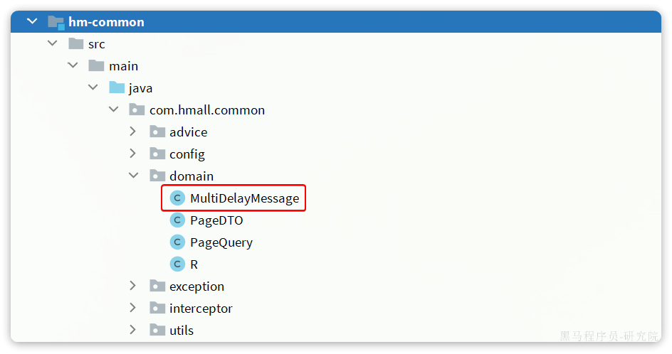
代码如下：

```java
package com.hmall.common.domain;

import com.hmall.common.utils.CollUtils;
import lombok.Data;

import java.util.List;

@Data
public class MultiDelayMessage<T> {
    /**
     * 消息体
     */
    private T data;
    /**
     * 记录延迟时间的集合
     */
    private List<Long> delayMillis;

    public MultiDelayMessage(T data, List<Long> delayMillis) {
        this.data = data;
        this.delayMillis = delayMillis;
    }
    public static <T> MultiDelayMessage<T> of(T data, Long ... delayMillis){
        return new MultiDelayMessage<>(data, CollUtils.newArrayList(delayMillis));
    }

    /**
     * 获取并移除下一个延迟时间
     * @return 队列中的第一个延迟时间
     */
    public Long removeNextDelay(){
        return delayMillis.remove(0);
    }

    /**
     * 是否还有下一个延迟时间
     */
    public boolean hasNextDelay(){
        return !delayMillis.isEmpty();
    }
}

```


### 4.5.1.定义常量

无论是消息发送还是接收都是在交易服务完成，因此我们在`trade-service`中定义一个常量类，用于记录交换机、队列、RoutingKey等常量：

内容如下：

```java
package com.hmall.trade.constants;

public interface MqConstants {
    String DELAY_EXCHANGE = "trade.delay.topic";
    String DELAY_ORDER_QUEUE = "trade.order.delay.queue";
    String DELAY_ORDER_ROUTING_KEY = "order.query";
}
```

### 4.5.2.抽取共享mq配置

我们将mq的配置抽取到nacos中，方便各个微服务共享配置。
在nacos中定义一个名为`shared-mq.xml`的配置文件，内容如下：

```yaml
spring:
  rabbitmq:
    host: ${hm.mq.host:192.168.150.101} # 主机名
    port: ${hm.mq.port:5672} # 端口
    virtual-host: ${hm.mq.vhost:/hmall} # 虚拟主机
    username: ${hm.mq.un:hmall} # 用户名
    password: ${hm.mq.pw:123} # 密码
    listener:
      simple:
        prefetch: 1 # 每次只能获取一条消息，处理完成才能获取下一个消息
```

这里只添加一些基础配置，至于生产者确认，消费者确认配置则由微服务根据业务自己决定。

在`trade-service`模块添加共享配置：
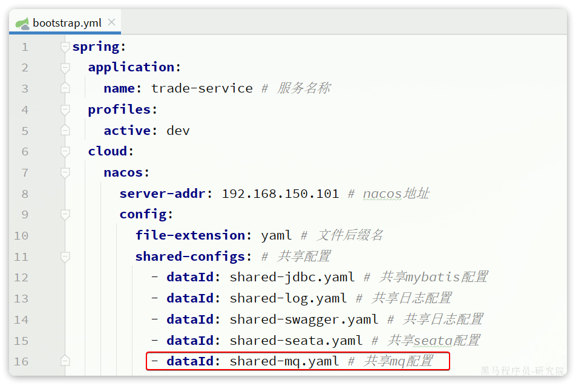

### 4.5.3.改造下单业务

接下来，我们改造下单业务，在下单完成后，发送延迟消息，查询支付状态。

1）引入依赖
在`trade-service`模块的`pom.xml`中引入amqp的依赖：

```xml
  <!--amqp-->
  <dependency>
      <groupId>org.springframework.boot</groupId>
      <artifactId>spring-boot-starter-amqp</artifactId>
  </dependency>
```

2）改造下单业务
修改`trade-service`模块的`com.hmall.trade.service.impl.OrderServiceImpl`类的`createOrder`方法，添加消息发送的代码：
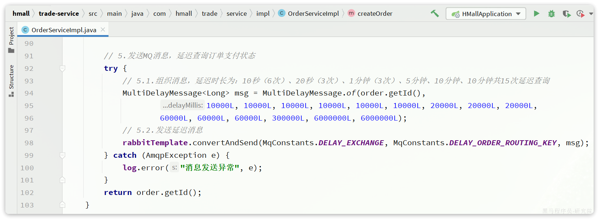

### 4.5.4.编写查询支付状态接口

由于MQ消息处理时需要查询支付状态，因此我们要在pay-service模块定义一个这样的接口，并提供对应的FeignClient.
首先，在hm-api模块定义三个类：

说明：

- PayOrderDTO：支付单的数据传输实体
- PayClient：支付系统的Feign客户端
- PayClientFallback：支付系统的fallback逻辑

PayOrderDTO代码如下：

```java
package com.hmall.api.dto;

import io.swagger.annotations.ApiModel;
import io.swagger.annotations.ApiModelProperty;
import lombok.Data;

import java.time.LocalDateTime;

/**
 * <p>
 * 支付订单
 * </p>
 */
@Data
@ApiModel(description = "支付单数据传输实体")
public class PayOrderDTO {
    @ApiModelProperty("id")
    private Long id;
    @ApiModelProperty("业务订单号")
    private Long bizOrderNo;
    @ApiModelProperty("支付单号")
    private Long payOrderNo;
    @ApiModelProperty("支付用户id")
    private Long bizUserId;
    @ApiModelProperty("支付渠道编码")
    private String payChannelCode;
    @ApiModelProperty("支付金额，单位分")
    private Integer amount;
    @ApiModelProperty("付类型，1：h5,2:小程序，3：公众号，4：扫码，5：余额支付")
    private Integer payType;
    @ApiModelProperty("付状态，0：待提交，1:待支付，2：支付超时或取消，3：支付成功")
    private Integer status;
    @ApiModelProperty("拓展字段，用于传递不同渠道单独处理的字段")
    private String expandJson;
    @ApiModelProperty("第三方返回业务码")
    private String resultCode;
    @ApiModelProperty("第三方返回提示信息")
    private String resultMsg;
    @ApiModelProperty("支付成功时间")
    private LocalDateTime paySuccessTime;
    @ApiModelProperty("支付超时时间")
    private LocalDateTime payOverTime;
    @ApiModelProperty("支付二维码链接")
    private String qrCodeUrl;
    @ApiModelProperty("创建时间")
    private LocalDateTime createTime;
    @ApiModelProperty("更新时间")
    private LocalDateTime updateTime;
}

```

PayClient代码如下：

```java
package com.hmall.api.client;

import com.hmall.api.client.fallback.PayClientFallback;
import com.hmall.api.dto.PayOrderDTO;
import org.springframework.cloud.openfeign.FeignClient;
import org.springframework.web.bind.annotation.GetMapping;
import org.springframework.web.bind.annotation.PathVariable;

@FeignClient(value = "pay-service", fallbackFactory = PayClientFallback.class)
public interface PayClient {
    /**
     * 根据交易订单id查询支付单
     * @param id 业务订单id
     * @return 支付单信息
     */
    @GetMapping("/pay-orders/biz/{id}")
    PayOrderDTO queryPayOrderByBizOrderNo(@PathVariable("id") Long id);
}
```

PayClientFallback代码如下：

```java
package com.hmall.api.client.fallback;

import com.hmall.api.client.PayClient;
import com.hmall.api.dto.PayOrderDTO;
import lombok.extern.slf4j.Slf4j;
import org.springframework.cloud.openfeign.FallbackFactory;

@Slf4j
public class PayClientFallback implements FallbackFactory<PayClient> {
    @Override
    public PayClient create(Throwable cause) {
        return new PayClient() {
            @Override
            public PayOrderDTO queryPayOrderByBizOrderNo(Long id) {
                return null;
            }
        };
    }
}

```

最后，在pay-service模块的PayController中实现该接口：

```java
@ApiOperation("根据id查询支付单")
@GetMapping("/biz/{id}")
public PayOrderDTO queryPayOrderByBizOrderNo(@PathVariable("id") Long id){
    PayOrder payOrder = payOrderService.lambdaQuery().eq(PayOrder::getBizOrderNo, id).one();
    return BeanUtils.copyBean(payOrder, PayOrderDTO.class);
}
```

### 4.5.5.消息监听

接下来，我们在trader-service编写一个监听器，监听延迟消息，查询订单支付状态：
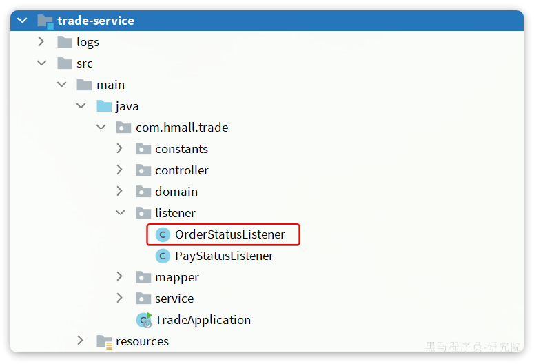
代码如下：

```java
package com.hmall.trade.listener;

import com.hmall.api.client.PayClient;
import com.hmall.api.dto.PayOrderDTO;
import com.hmall.common.domain.MultiDelayMessage;
import com.hmall.trade.constants.MqConstants;
import com.hmall.trade.domain.po.Order;
import com.hmall.trade.service.IOrderService;
import lombok.RequiredArgsConstructor;
import lombok.extern.slf4j.Slf4j;
import org.springframework.amqp.core.ExchangeTypes;
import org.springframework.amqp.rabbit.annotation.Exchange;
import org.springframework.amqp.rabbit.annotation.Queue;
import org.springframework.amqp.rabbit.annotation.QueueBinding;
import org.springframework.amqp.rabbit.annotation.RabbitListener;
import org.springframework.amqp.rabbit.core.RabbitTemplate;
import org.springframework.stereotype.Component;

@Slf4j
@Component
@RequiredArgsConstructor
public class OrderStatusListener {

    private final IOrderService orderService;

    private final PayClient payClient;

    private final RabbitTemplate rabbitTemplate;

    @RabbitListener(bindings = @QueueBinding(
            value = @Queue(name = MqConstants.DELAY_ORDER_QUEUE, durable = "true"),
            exchange = @Exchange(name = MqConstants.DELAY_EXCHANGE, type = ExchangeTypes.TOPIC),
            key = MqConstants.DELAY_ORDER_ROUTING_KEY
    ))
    public void listenOrderCheckDelayMessage(MultiDelayMessage<Long> msg) {
        // 1.获取消息中的订单id
        Long orderId = msg.getData();
        // 2.查询订单，判断状态：1是未支付，大于1则是已支付或已关闭
        Order order = orderService.getById(orderId);
        if (order == null || order.getStatus() > 1) {
            // 订单不存在或交易已经结束，放弃处理
            return;
        }
        // 3.可能是未支付，查询支付服务
        PayOrderDTO payOrder = payClient.queryPayOrderByBizOrderNo(orderId);
        if (payOrder != null && payOrder.getStatus() == 3) {
            // 支付成功，更新订单状态
            orderService.markOrderPaySuccess(orderId);
            return;
        }
        // 4.确定未支付，判断是否还有剩余延迟时间
        if (msg.hasNextDelay()) {
            // 4.1.有延迟时间，需要重发延迟消息，先获取延迟时间的int值
            int delayVal = msg.removeNextDelay().intValue();
            // 4.2.发送延迟消息
            rabbitTemplate.convertAndSend(MqConstants.DELAY_EXCHANGE, MqConstants.DELAY_ORDER_ROUTING_KEY, msg,
                    message -> {
                        message.getMessageProperties().setDelay(delayVal);
                        return message;
                    });
            return;
        }
        // 5.没有剩余延迟时间了，说明订单超时未支付，需要取消订单
        orderService.cancelOrder(orderId);
    }
}

```

注意，这里要在OrderServiceImpl中实现cancelOrder方法，留作作业大家自行实现。

# 5.作业

## 5.1.取消订单

在处理超时未支付订单时，如果发现订单确实超时未支付，最终需要关闭该订单。
关闭订单需要完成两件事情：

- 将订单状态修改为已关闭
- 恢复订单中已经扣除的库存

这部分功能尚未实现。
大家要在`IOrderService`接口中定义`cancelOrder`方法：

```java
void cancelOrder(Long orderId);
```

并且在`OrderServiceImpl`中实现该方法。实现过程中要注意业务幂等性判断。

## 5.2.抽取MQ工具

MQ在企业开发中的常见应用我们就学习完毕了，除了收发消息以外，消息可靠性的处理、生产者确认、消费者确认、延迟消息等等编码还是相对比较复杂的。
因此，我们需要将这些常用的操作封装为工具，方便在项目中使用。要求如下：

- 在`hm-commom`模块下编写发送消息的工具类`RabbitMqHelper`
- 定义一个自动配置类`MqConsumeErrorAutoConfiguration`，内容包括：
  - 声明一个交换机，名为`error.direct`，类型为`direct`
  - 声明一个队列，名为：`微服务名 + error.queue`，也就是说要动态获取
  - 将队列与交换机绑定，绑定时的`RoutingKey`就是`微服务名`
  - 声明`RepublishMessageRecoverer`，消费失败消息投递到上述交换机
  - 给配置类添加条件，当`spring.rabbitmq.listener.simple.retry.enabled`为`true`时触发


RabbitMqHelper的结构如下：

```java
public class RabbitMqHelper {

    private final RabbitTemplate rabbitTemplate;

    public void sendMessage(String exchange, String routingKey, Object msg){

    }

    public void sendDelayMessage(String exchange, String routingKey, Object msg, int delay){

    }

    public void sendMessageWithConfirm(String exchange, String routingKey, Object msg, int maxRetries){
        
    }
}
```

## 5.3.改造业务

利用你编写的工具，改造支付服务、购物车服务、交易服务中消息发送功能，并且添加消息确认或消费者重试机制，确保消息的可靠性。

